## idea的一些设置：
- 中文界面：
    - 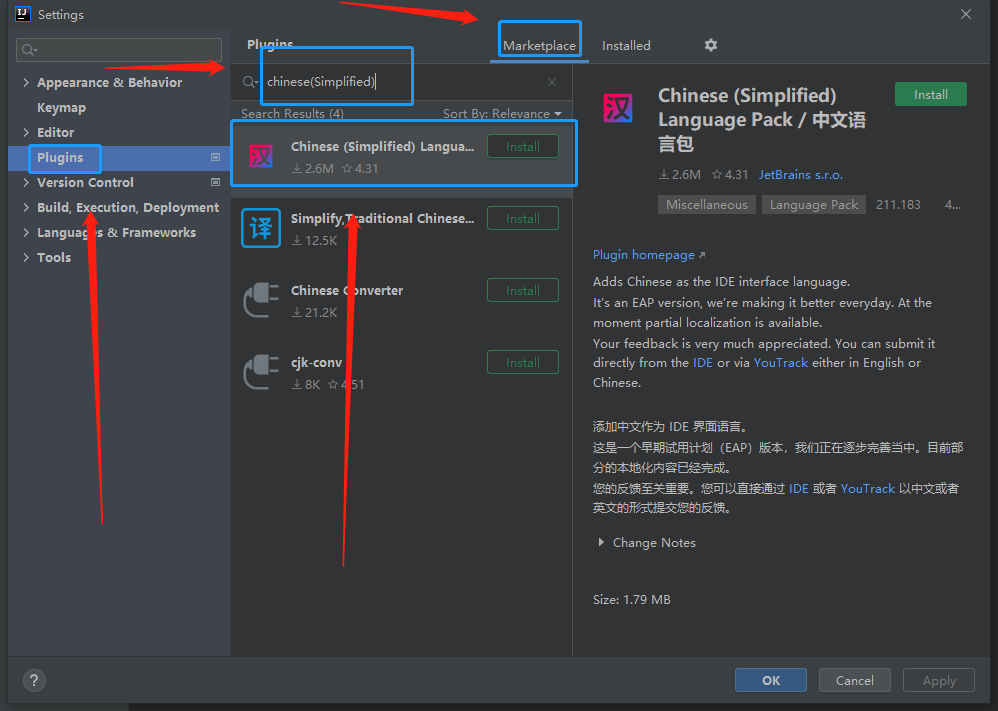

- 补全
    - 因为有些大小写会看心情出现全名
    - 我们取消这个勾选 √ 
    - 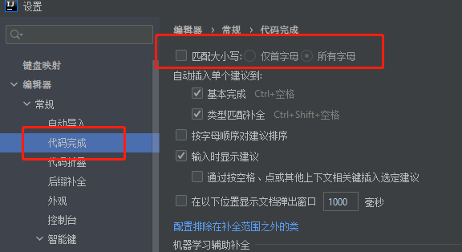
    
- 方法之间的分割线
    - 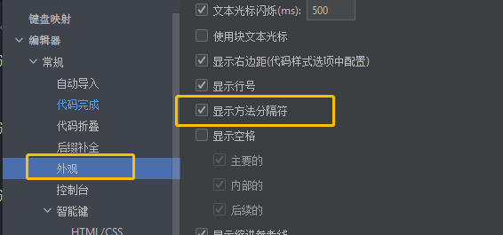

- 编辑区外字体格式
    - 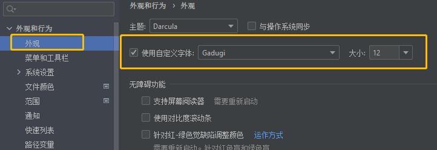

- 编辑区内字体格式
    - 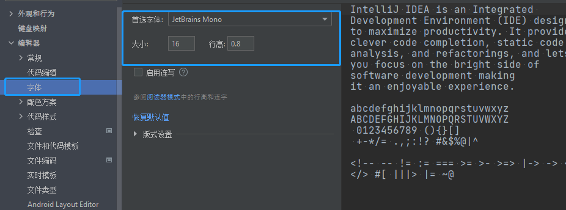

- 优化导包
    - 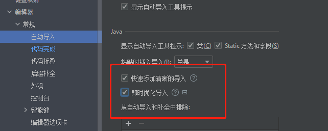

- 文件编码
    - 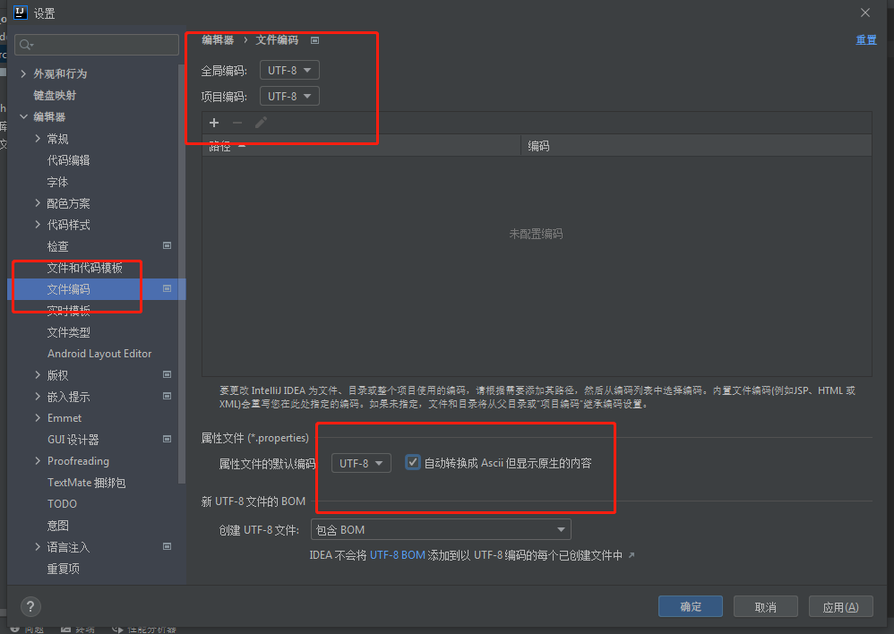

- 新文件编码
    - 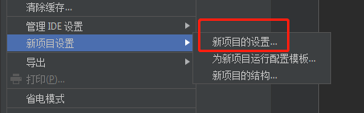
    - 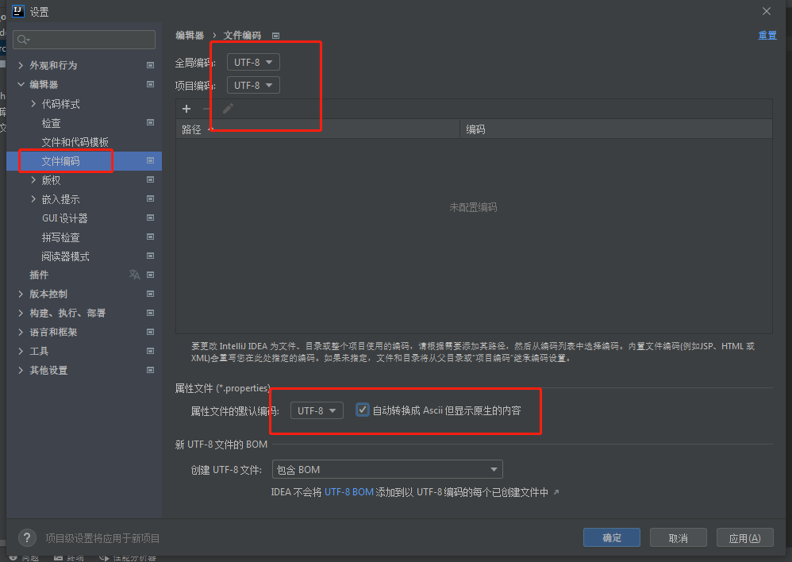

## plugins下载不了,就去插件中心下载插件

- download下载下来(很慢,所以复制连接去迅雷,或者其他)

- 点 plugins 里面由上面的 install plugins from disk 

- 然后双击那个zip压缩包就行了

## 设置注释信息

file ---> settings ---> Editor ---> File and Code Templates ---> Includes ---> File Header

## idea快捷键

- main 直接出方法
- ctrl + d  直接复制一行到下一行
- ctrl + x  直接删除一行
- ctrl + c  直接复制一行
- sout 直接出打印

## 阿里规约之缩进设置
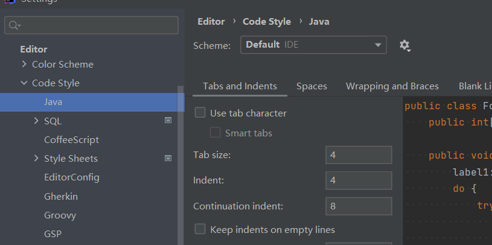

## 建工程

步骤|操作|
---|---|
1|新建项目并手打项目名在第二行|
2|将src删除|
3|右击项目名并新建module|
4|取module name|
5|右击新的module名字|
6|新建javaclass|

## 配置java 环境
### 配置jdk
file ---> Project Structure
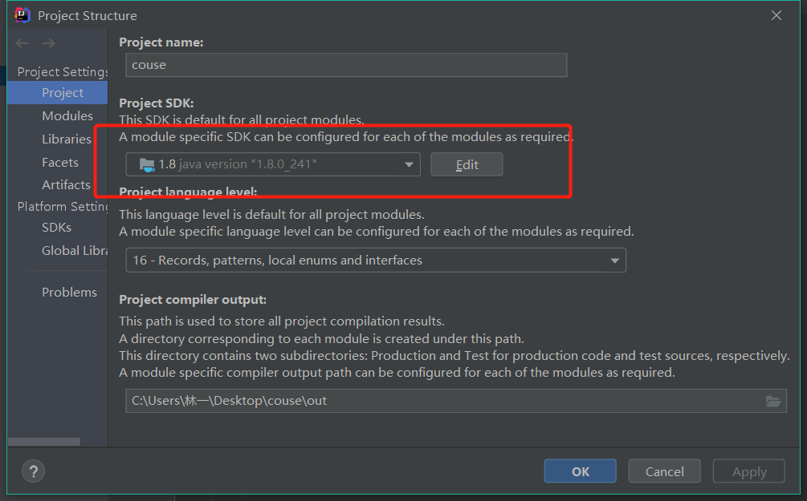

## 改快捷键
settings ---> keymap ---> 搜索 ---> 左键两下