# HelloWorld
- 编写：
    - 
    ``` java
    class HelloWorld{
    public static void main(String args[]){
        System.out.println("HelloWorld");
    }
    }
    ```
    
    - 该Java文件的文件路径在 ：C:\Users\Hadoop\Desktop\The_one_java\src\java_text
    - 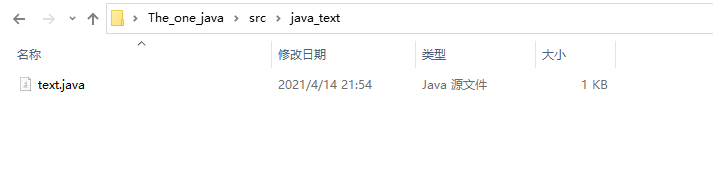
- 命令行 ----> 执行编译：
    - javac C:\Users\Hadoop\Desktop\The_one_java\src\java_text\text.java
    - 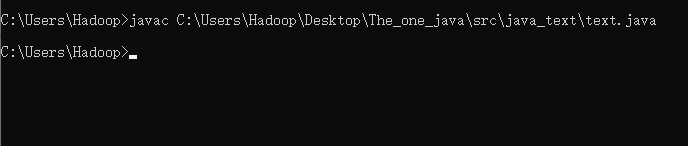
    - 编译后原文件出现class文件，就是电脑机器看的文件，不是人看的，要看也是可以看
    - 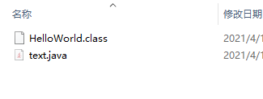
- 命令行 ----->执行class文件
    - java -cp C:\Users\Hadoop\Desktop\The_one_java\src\java_text HelloWorld
        - cd 的意思就是classpath 这个类的路径
    - 


# 了解java 编程规范：

## java 总体命名规范

规范|
---|
|
组成：  $ _ 字母 数字 |
但是不能以数字开头 |
不能以下划线和美元符号开头和结尾|
规范： 文件名跟类名保持一致|
名字不能使用关键字|
中文坚决不能出现（但是可以写上中文）|
能不用拼音就不用拼音|
不能混用拼音和英文|
类名严格遵循驼峰式命名|
main为入口方法，不能换成其他的名字|
|
|

## 注释

- 单行注释：
    - ```java
        // 注释内容（双斜杠后有一空格）

- 多行注释：
    - ```java
        /*
         * 1.举行典礼
         * 2.宣讲内容
         */

- 文档类型注释：
    - ```java
        /**
         *author:suplin
         *time:2021/4/15 18:19
         */

## 变量
> 变量是指向某一块内存区域的引用

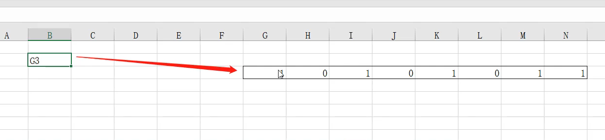

- 变量两要素：
    - 有个东西指向内存的第一个位置
    - 有个东西知道他有多长，即知道有多少个 0 1 
    - 方能精准定位

- 类型 + 变量


# 数据类型
-
-
-

- java中只有基础数据类型和引用数据类型

- 除了基础数据类型剩下的都是引用数据类型

-
-
-
> 四类八种：<hr>
- 整数类型
    - byte , short , int , long
- 浮点类型
    - float , double
- 字符型
    - char
- 布尔型
    - boolean
<hr>


> 引用网页内容：

```md
java四类八种基本数据类型
    第一类：整型 byte short int long 
    第二类：浮点型 float double
    第三类：逻辑型 boolean(它只有两个值可取true false)
    第四类：字符型 char

字节：
    boolean 布尔型              1/8 
    byte 字节类型                1
    char 字符型                  2    一个字符能存储一个中文汉字
    short 短整型                 2
    int 整数类型                 4
    float 浮点类型（单精度）      4
    long 长整形                  8
    double 双精度类型（双精度）   8
java中默认的整数类型是int类型，如果要定义为float型，则要在数值后加上l或L；
默认的浮点型也是双精度浮点，如果要定义为float型，则要在数值后加上f或F。

一个字节等于8位，一个字节等于256个数，就是-128到127一共256。
kB就是kBytes 
Bytes就是“字节”的意思！ 
K就是千的意思，因为计算机是通过二进制来计算，10个1正好是1024
1111111111（二进制）=1024（十进制）
1Bytes（字节）=8bit（比特） 
一个英文字母或一个阿拉伯数字就是一个字符，占用一个字节 
一个汉字就是两个字符，占用两个字节。 
一般讲大小是用Bytes，大写的“B”，讲网络速率是用bit，注意是小写的“b”。 
例：一个文件有8MBytes 
例：我下载文件的速率是256KB/s，即2Mbit，这通常就是我们宽带上网的速率。

基本数据类型自动转换
byte->short,char -> int -> long
float -> double
int -> float
long -> double

记住：小可转大，大转小会失去精度！！！
```

## 开聊byte类型：
- 二进制范围：

```md
内存里不能放负数，所以规定：
0开头为正数，1开头为负数（开头的数字代表正负，就不同算进去了）

所以有正数:
最小为-----> 0 0000000
最大为-----> 0 1111111

负数:
最大为-----> 1 0000000
最小为-----> 1 1111111

所以正数范围（十进制）：  0   -  127
负数范围（十进制）：    -127  -  -0
因为 -0 = 0  所以在计算器里面，11111111 为 -128
所以二进制范围为： -128  -  127
```

- 原码 ， 补码 ， 反码

```md
1 是多少： 00000001
-1 是多少：10000001
那 1 + （-1） = 0 的话
上面两个二进制相加为： 10000010  为-2   ？？？？？
```

- 原码概念：

```md
正数的 反码 ，  补码 都是本身
负数：
反码：除了第一个符号位，其余取反
补码：反码加 1 

例：
十进制的 2 的二进制：
00000010 它的反码补码是本身
十进制的 -2 的二进制：
10000010 它的反码：11111101 它的补码：11111110

用 2 的补码加上 -2 的补码：
00000010 + 11111110 = 100000000
溢出第九位，所以为 0 
```

- 用补码计算范围：

```md
-126 的原码为 11111110
       反码为 10000001
       补码为 10000010
so  -127 的补码为： 10000001

so  -128 的补码为： 10000000
又因为 127 为 01111111

so 范围为 -128  ---  127
```

- 其他整型的范围：

```md 
short :
 01111111111111111   到1000000000000000
也就是： -2的负15次方 到 2的正15次方-1

int:
-2的31次方到2的31次方-1

long:
-2的63次方到2的63次方-1
```

## 开聊 浮点型：
- 浮点型二进制  转换成  浮点型十进制：

```python
101.01
1*2^2 + 0*2^1 + 1*2^0    +   0*2^-1 + 1^2*-2
4+0+1+0+0.25
结果为：5.25
```

```python
二进制   1.1 * 2^2 = 110
十进制   1.5 * 4   = 6

而  110 = 6
```

```md
浮点型范围：
因为 规定 全零 和 全一 不表示
所以 范围为： 1-254

即    -127  -  126
但是规定在指数上加一 ： 即   -126  -  127

```

```md
-126 --- 127  为补码
全加127
1 --- 254   为移码
```

```md
正数最小值为：1.000000000……*2^-126    （即向左移动） 即 000000……1
正数最大值为：1.111111111……*2^127
```

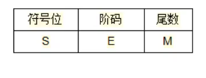


# 编码历程

- ＡＳＣＩＩ
    - 7位 即 00000000 --- 0111111 之间的编码
    - 仅限使用英文的国家
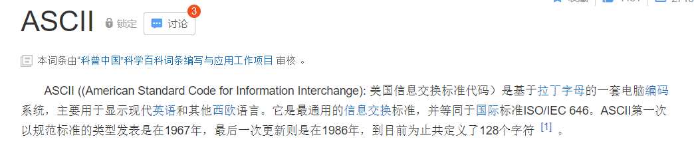

- ISO-8859-1
    - 单字节编码，前七位与ASCII码一致
    - 西欧国家使用，是在ASCII编码中加入了其余类似俄语的编码
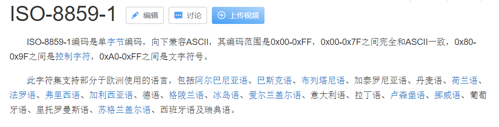

- unicode
    - 双字节码，叫万国码，统一码
    - java默认编码，char则是使用unicode编码
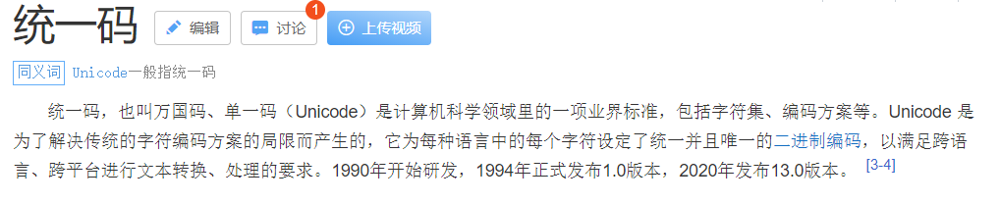

- utf-8
    - 由于用unicode编码时，美国人打了十个字母，却用了两倍的字节来储存
    - 英文字母一个字节，某些符号两个字节，汉字三个字节
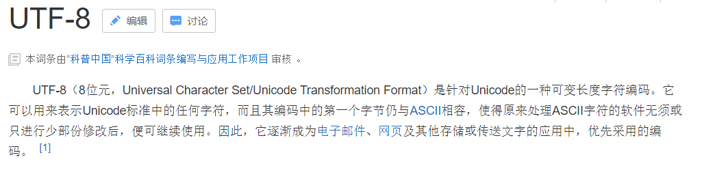


# 运算符

> false 是 0 

> true 是 1

## 算数运算符
```
+  -  *  /  %(取余,10/3=3---1,1为余数)  ++  --  +=  -=  *=  /=
```

- ++
```java
/*
 * num+ 即 num = 1
 * ++ 在后面:先 打印 num 后 num + 1
 * ++ 在前面:先 num + 1 后 打印 num
 */

class Int{
    public static void main(String args[]){
        System.out.println("*****");

        int num = 0;

        System.out.println(num+);
        System.out.println(+num);

    }
    }
```

```cmd
*****
0
1
```

好像上面的代码有点毛病,但我实践是这样,跟教程居然不同,我裂开<br>
-- 的用法跟上面一样

- +=
    - conut = count + 3  <====>  count += 3
    - -= ，*=， /= 的用法跟上面一样

## 逻辑运算符

运算结果为: true 或者 false

```
& | ! ^ && || > < >= <= == !=
```

```java
/*
 *分别打印
 *与(一假为假)  0&0=0  ;  0&1=0  ;  1&0=0  ;  1&1=1  ，
 *或(一真为真)  0|0=0  ;  0|1=1  ;  1|0=1  ;  1|1=1  ,
 *非(取反)，
 *异或(相同为假，不同为真)
 */

class Boolean{
    public static void main(String args[]){
        System.out.println("*****");

        boolean a = true;
        boolean b = false;
          
        System.out.println(a & b);

        System.out.println(a | b);
        
        System.out.println(!b);
        
        System.out.println(a ^ b);
    }
    }
```

```cmd
*****
false
true
true
true
```

借鉴网络
```md
设真值为1，假值为0（true = 1, false = 0）。

与运算符：


与(&&)：逻辑规则是两真才真。与and等同。


 true &&  true = true    ===>   1 && 1 = 1

 true && false = false    ===>   1 && 0 = 0

 false && false = false    ===>   0 && 0 = 0

 false && true = false    ===>   0 && 1 = 0


或运算符：

或(||)：逻辑规则是只有一个为真就为真。与or等同。


 true ||  true = true    ===>   1 || 1 = 1

 true || false = true    ===>   1 || 0 = 1

 false || false = false   ===>  0 || 0 = 0

 false || true = true    ===>   0 || 1 = 1


异或运算符：

异或(^)：逻辑规则是两个不同就为真。


 true ^  true = false    ===>   1 ^ 1 = 0

 true ^ false = true    ===>   1 ^ 0 = 1

 false ^ false = false    ===>   0 ^ 0 = 0

 false ^ true = true    ===>   0 ^ 1 = 1


非运算符：

非(！)：逻辑规则是反转操作数的含义。与not等同。


！true =false  ===>   ！1 = 0

！false=true   ===>   ！0 =1

执行顺序：not > and > or

```


- 短路运算符:&& ||
    - 机器为了更加效率的运算出结果,当遇到短路运算符时:
        - false && *** 则直接得出false的结果,不再往后算
        - true || *** 则直接得出true的结果,不再往后算

## 三目运算符

- condition ? result1 : result2<br>
条件 ? true返回值1 : false返回值2

  -  ```java
      class Sanmu{
        public static void main(String args[]){
            System.out.println("*****");

            int res = 3>4 ? 6 : 7;
            System.out.println(res);
        }
        }
    ```
      
  - ```cmd
      *****
      7
      ```

## 位移运算符
```md
java中有三种移位运算符

<<      :     左移运算符，num << 1,相当于num乘以2

>>      :     右移运算符，num >> 1,相当于num除以2

>>>    :     无符号右移，忽略符号位，空位都以0补齐
```

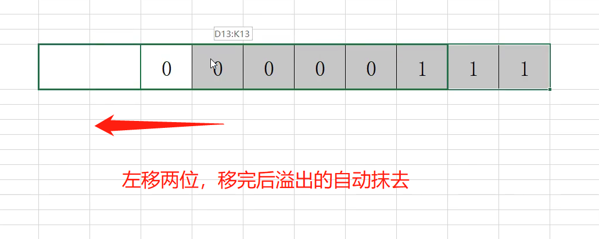
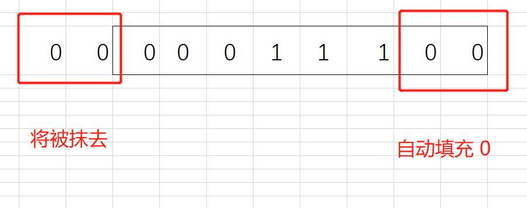

> 无符号移动运算符就是在符号位自动填充为0

> 有符号移动运算符就是在符号位:正数填 0 ,负数填 1

- 运算下运算下:
    - ```java
      class Weiyi{
        public static void main(String args[]){
            System.out.println("*****");

            int num = 1 << 2;
            System.out.println(num);

        }
        }
      ```
    
    - ```md
      *****
      4
      ```

    - 00000001 向左移动两位,即 00000100<br>
    00000100 即 2^2 即 4

> 总结:

    在不溢出最前边的1的情况下
    <<    ----->   num * 2^n 

    在不溢出最后边的1的情况下
    >>    ----->   num * 2^n 

## 基本数据类型转换
> 低位转高位,可直接转,因为空余的位数可直接补 0 :

    byte num1 = 10;
    short num2 = num1;
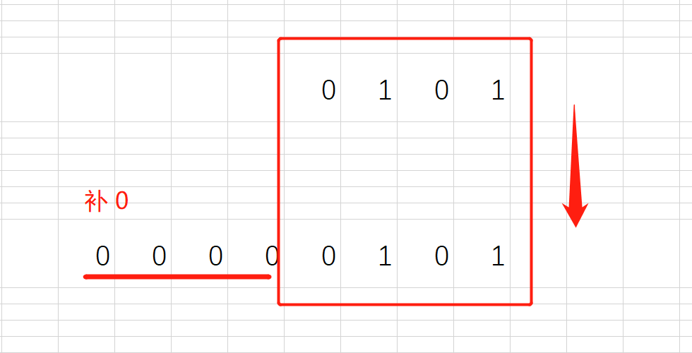

> 高位转低位,溢出的直接抹去了

    short num1 = 3000;
    byte num2 = (byte)num1;
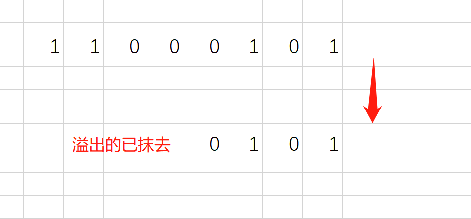

- 例
```java

class Weiyi{
    public static void main(String args[]){
        System.out.println("*****");

        short num1 = 129;
        byte num2 = (byte)num1;
        System.out.println(num2);

    }
    }

```

```md
*****
-127
```

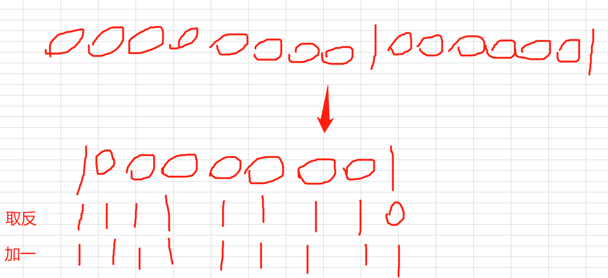


## 基本数据类型 变量 之间的运算

> 整数型（int，byte，short，long）变量之间相互间进行逻辑运算或算术运算，结果默认为 int 类型<br>但是long + 任何整数型都为long<br>
若想运算成功，则需要在结果前加整型数据类型<br>数据相互运算则可直接运算

	```java
	short s = 12;
	byte b = 12;
	short q = (short)(s+b);
	```


> 浮点型（float，double）变量之间相互间进行逻辑运算或算术运算，结果默认为 float 类型<br>
若想运算成功，则需要在结果前加整型数据类型<br>数据相互运算则可直接运算

	单精度 + 单精度 = 单精度
	双精度 + 双精度 = 双精度
	单精度 + 双精度 = 双精度
	


# 语句:

## scanner 和 String

- scanner
```java

import java.util.Scanner;

Scanner scanner = new Scanner(System.in);
int a = scanner.nextInt();;
System.out.println(a);

```

- String

```java
// String 使用的是双引号，char 使用的是单引号
String b = "Hello" + " World";
System.out.println(b);

```

## if

```java
import java.util.Scanner;


class If{
	public static void main(String[] args){

	Scanner scanner = new Scanner(System.in);

	int i = scanner.nextInt();


	if (i <= 2){
		System.out.println("您输入的数字小于等于2");	
	}
	else if(2 < i & i <= 100){
		System.out.println("您输入的数字大于2并小于100");
	}
	else if(100 < i & i <= 500){
		System.out.println("您输入的数字大于100并小于500");
	}
	else {
		System.out.println("您输入的数太大啦");	
	}
	

	}
}
```

> 阿里Java规范：

	在 if 语句两边分别要加空格，并在大小等于号两头也要加空格；
	左大括号不换行，右大括号换行；
	如果有多个if语句，右大括号后  不换行  ；
	如果只有一个if条件，后头可以不写大括号，但建议写


## switch
```java
import java.util.Scanner;

class If{
    public static void main(String args[]){
        Scanner scanner = new Scanner(System.in);

        int i = scanner.nextInt();
      
        switch (i) {
            case 1 :
                System.out.println("查询话费");
                break;
            case 2 :
                System.out.println("查询流量");
                break;
        }

    }
    }
```

## while & do while
```java
class While{
    public static void main(String args[]){

        // 如果条件那里写 true 叫死循环


        int i = 1;
        // 先判断,后执行
        while (i <= 10 & i > 0){
            System.out.println(i);
            i++;
        };


        System.out.println("------------");


        int a = 1;
        // 先执行,后判断
        do {
            System.out.println(a);
            a++;
        } while (a <= 10 & a > 0);

    }
    }
    
```

```cmd
1
2
3
4
5
6
7
8
9
10
------------
1
2
3
4
5
6
7
8
9
10
```

## for
```java
class For{
    public static void main(String args[]){

        /**
        * for(变量;条件;变化)
        * 如果变量在for里面,则作用域就是整个for循环
        * 如果变量在外面定义了,作用域就是整个方法,括号里面直接写分号
        * 条件只需要返回的是false 或者true 就行,多复杂都行
        * 条件不写则是死循环
        * 变化也可以写在for循环里面
        */

        int i = 1;
        for (;i <= 10;i++){
            * System.out.println(i);
        }

    }
}
```

- 双重for循环
    ```java
    for (int i = 0; i < 4; i++){
        System.out.println("----第" + i + "次----");
        for (int j = 1;j <= 9;j++){
            System.out.println(j)
        }
    }
    ```

- 打印直三角形
    ```java
    class For{
        public static void main(String args[]){

            for (int i = 0;i < 10;i++){
                for (int j = 0;j < i+1;j++){
                    System.out.print("* ");
                };
                System.out.println();
            }

        }
    }
    ```

- 九九乘法表
    ```java
    class For{
    public static void main(String args[]){

        for (int i = 1;i < 10;i++){
            for (int j = 1;j < i+1;j++){
                System.out.print(" " + j + "*" + i + "=" + (i*j));
            };
            System.out.println();
        }

    }
    }
    ```

- 打印反面直三角形
    ```java
    class For{
        public static void main(String args[]){

            for (int i = 0;i < 10;i++){
                for (int j = 0;j < 10;j++){
                    if (j < 9-i){
                        System.out.print("  ");
                    }else {
                        System.out.print("* ");
                    }
                };
                System.out.println();
            }

        }
    }
    ```

## 两个关键字
关键字|差别
---|---|
continue|直接跳出循环
break|结束本次循环<br>继续下次循环

- 代码块
```java
class BreakContinue{
public static void main(String args[]){

    for (int i = 1;i < 20;i++){
        if (i == 10) {
            break;
        }
        System.out.println(i);
    }

    System.out.println("----------");

    for (int j = 1;j < 20;j++){
        if (j == 10) {
            continue;
        }
        System.out.println(j);    
    }
}
}
```

# 数组
- 三种定义数组的方法:
    ```java

    // 初始化定义
    int[] nums = new int[3]
    // 类型[] 名字 = new 类型[长度]

    // 直接赋值
    int[] nums = {1,2,3}

    // 先定义,后初始化
    int[] nums;
    nums = new int[3]
    ```

- 数组性质:
    - 初始化数组后,默认为 0
    - 不能定义超过长度的下标(不能多定义)
    - 数组一旦建立长度,不能改变长度
    - 数组最后一个数的下标为length-1
    - 数组类型可以是基本类型,也可以是引用类型

- 查看数组长度
    - System.out.println(nums.length)

## 数组的数组
- int[][] num = new int[3][4]

## 迭代打印
```java
for (int i = 0;i < nums.length;i++){
    System.out.println(nums[i]);
}
```
## 迭代打印最大值
```java
int max = nums[0];
for (int i = 1;i < nums.length;i++){
    if (num[i] > max){
        max = num[i];
    }
}
System.out.println(max);
```

## 迭代找下标
```java
int[] nums = {2,3,4,5,6,7};
// 查找 5 的下标
for (int i = 0;i < nums.length;i++){
    if (num[i] == 5){
        System.out.println(i)
    }
}
```

## 元素替换
```java
int[] nums = {1,2,3,4,5,6}
int a = nums[2]
nums[2] = nums[0]
nums[0] = a
```


## 数组反向排序
```java
/**
 * @author 林一
 * @data 2021/4/25
 */
public class Index {
    public static void main(String[] args) {
        int[] nums = {1,2,3,4,5,6,7};
        int[] temps = new int[nums.length];
        for (int i = 0; i < nums.length; i++) {
            temps[i] = nums[nums.length-1-i];
        }
        for (int temp : temps) {
            System.out.println(temp);
        }
    }
}

```


# 算法(选择,冒泡,插入)

## 选择排序
```java
class Xuanze{
    public static void main(String args[]){

        // 定义个数组
        int[] nums = {5,6,2,3,4,10,1};

        // 迭代 length-1 次
        for (int j = 0; j < nums.length-1;j++){
            
            // 取第 j 个的下标 作为 最小值的下标
            int min = j;

            // 选取到 排完序后最小值的后一位 来跟最小值比较
            for (int i = j+1; i < nums.length;i++){
                if(nums[i] < nums[min]){

                    // 将 最小值 的下标 替换成比较后 比最小值小的数的下标
                    min = i;
                }
            }

            // 迭代一回 就将最小值放在前面
            int data = nums[j];
            nums[j] = nums[min];
            nums[min] = data; 
        }

        // 迭代各个值,然后将其打印出来呈现
        for (int i = 0; i < nums.length;i++){
            System.out.print(nums[i]);
        }

    }
}
```

> 即一轮一轮的找出最小值,依次放在前面


## 冒泡排序
```java
class Maopao{
    public static void main(String[] args){
        int[] nums = {34,14,5,32,12,54,1,11,33,12,3};

        /* 
         * 第一个for循环即比几轮的意思,length-1 是因为 
         * 最后只剩下最后一个的时候不用再加一轮了,剩下的一定是在最前面的并且是最小的
         */
        for (int i = 0;i < nums.length-1; i++){

            /*
             * 第二个for循环即两两比较几次的意思
             * 这里 -i 是因为:
             * 比了一轮后,肯定有一个最大值在最后面产生,
             * 那么我们就不用白白的浪费时间去比较最后已经比较出来的
             */
            for (int j = 0;j < nums.length-i-1;j++){
                if (nums[j] > nums[j + 1]){

                    // 下面即是替换数据的意思
                    int temp = nums[j];
                    nums[j] = nums[j+1];
                    nums[j+1] = temp;
            }
            }
        }

        // 最后迭代下打印查看是否排序成功
        for (int i = 0;i < nums.length;i++){
            System.out.println(nums[i]);
        }


    }
}
```

> 即一轮一轮的找出最大值,依次放在后面

## 插入排序
```java
class Charu{
    public static void main(String[] args){
        int[] nums = {34,14,5,32,12,54,1,11,33,12,3};

        
        // 从 1 号位 (第二个数) 开始比
        for (int i = 1;i < nums.length; i++){

            // 把要比较的数用 变量 接住
            int temp = nums[i];


            /*
             * 倒着比
             * 从 i-1 个开始比
             */
            for (int j = i-1;j >= 0;j--){
                if (nums[j] > temp){

                    /* 
                     * 这里为什么可以直接赋值别的数呢
                     * 因为那个比较的数的位置已经拿出来
                     * 并且是从后往前比,所以不会有覆盖的可能
                     */
                    nums[j+1] = nums[j];
                    if (j == 0){
                        nums[0] = temp;
                    }

                } else {

                    /*
                     * 如果前面的数比要比较的小
                     * 那么就放在要比较的数的后一位
                     */
                    nums[j+1] = temp;

                    // 插入成功后就break掉
                    break;
                }
            
            }
        }

        // 最后迭代下打印查看是否排序成功
        for (int i = 0;i < nums.length;i++){
            System.out.println(nums[i]);
        }


    }
}
```

## target
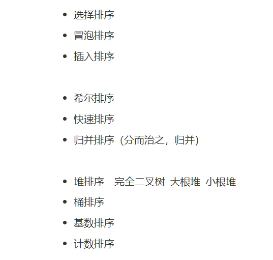

# 第一阶段小项目

```java
/*
 * time : 2021/4/21
 * author : Suplin
 */

import java.util.Scanner;
public class YuanGongAge {
    public static void main(String[] args){


        Scanner scanner = new Scanner(System.in);


        // 创建一个数组来存放员工年龄
        int[] users = new int[5];


        for (int i = 0;i < users.length;i++){

            System.out.println("请输入第" + (i+1) + "号员工年龄:");
            int temp = scanner.nextInt();

            // 依次给到各个员工年龄
            users[i] = temp;

        }


        // 立下一个 true 的flag 在当输入其他的数字时, flag 将改变成 false
        boolean flag = true;

        // flag 为 true ,会一直循环这个工程选择的程序   直到flag 为 false 时,结束循环 
        while(flag){ 

            System.out.println("-------------------------");
            System.out.println("-------------------------");
            System.out.println("-------------------------");

            // 开始给用户选择不同的功能
            System.out.println("工程选择:");
            System.out.println("1:年龄排序"+ "\n" + "2:显示年龄最大值" + "\n" + "3:显示年龄最小值" + "\n" + "4:添加新员工年龄" + "\n" + "5:删除旧员工年龄");
            System.out.println("请选择工程序号:");

            // 将输入的值存放在 function 中,后面对这个值做 分类,然后给到 不同的功能
            int function = scanner.nextInt();

            switch (function){


                case 1:


                    for (int i = 0 ; i < users.length-1; i++){
                        for (int j = 0 ; j < users.length-1-i; j++){
                            if (users[j] > users[j+1]){
                                int temp = users[j];
                                users[j] = users[j+1];
                                users[j+1] = temp;
                            }
                        }
                    }
                    System.out.println("####################");
                    System.out.println("以下为排序后的员工年龄");
                    for (int i = 0;i < users.length;i++){
                        System.out.println("第" + (i+1) + "号员工的年龄为" + users[i]);
                    }
                    break;


                case 2:
                    

                    int maxAge = users[0];
                    for (int i = 0; i < users.length;i++){
                        if (users[i] > maxAge){
                            maxAge = users[i];
                        }
                    }
                    System.out.println("####################");
                    System.out.println("咱们公司年龄最大的货已经" + maxAge + "岁了");
                    break;


                case 3:


                    int minAge = users[0];
                    for (int i = 0; i < users.length;i++){
                        if (users[i] < minAge){
                            minAge = users[i];
                        }
                    }
                    System.out.println("####################");
                    System.out.println("咱们公司年龄最小的货也已经" + minAge + "岁了");
                    break;


                case 4:


                    int[] addAge = new int[users.length+1];
                    for (int i = 0;i < users.length;i++){
                        addAge[i] = users[i];
                    }
                    System.out.println("####################");
                    System.out.println("请输入新的年龄:");
                    addAge[users.length] = scanner.nextInt();

                    // 指针指向另一个 存储空间 ,原来的会自动 销毁
                    users = addAge;

                    System.out.println("####################");
                    System.out.println("以下为排序后的员工年龄");
                    for (int i = 0;i < users.length;i++){
                        System.out.println("第" + (i+1) + "号员工的年龄为" + users[i]);
                    }
                    break;


                case 5:


                    System.out.println("~~~~~~~~~~~~~~~~~~~~");
                    System.out.println("以下为各员工年龄");
                    for (int i = 0;i < users.length;i++){
                        System.out.println("第" + (i+1) + "号员工的年龄为" + users[i]);
                    }
                    System.out.println();
                    System.out.println("~~~~~~~~~~~~~~~~~~~~");


                    System.out.println("请选择您需要删除的员工号");
                    int num = scanner.nextInt();


                    // 定义新的 变量 来充当删除后的暂时容器 
                    int[] dele = new int[users.length-1];
                    for (int i = 0; i < users.length;i++){
                        if (i+1 < num){

                            dele[i] = users[i];

                        } else if(i+1 == num){

                            continue;

                        } else {

                            dele[i-1] = users[i];
                            
                        }
                    }


                    users = dele;


                    System.out.println("####################");
                    System.out.println("以下为删除后的各员工年龄");
                    for (int i = 0;i < users.length;i++){
                        System.out.println("第" + (i+1) + "号员工的年龄为" + users[i]);
                    }
                    break;

                // 输入 其他的数字,将自动退出程序
                default:
                    System.out.println("#### sqgg  or  pljj  欢迎再次使用本程序 ####")
                    flag = false;

            }
        }
    }
}
```


# 增强for循环
- 例
    - ```java
        int arr = {1,2,3,4,5};
        (arr.iter 回车)
        for (int i : arr){
            (sout 回车)
            System.out.println(i);
        }
     ```

- 普通for循环好处:可以拿到下标

# 方法

> 方法是一种能力
1. 权限修饰符 (static静态) (<T>泛型) 返回型类型 名字(参数) {}
2. 静态方法和属性是属于类对象得,使用时,直接: 类名.方法()  类名.属性
3. 方法名: 驼峰式命名,首字母小写
4. 参数: 方法定义的时候是形参,方法调用的时候是实参
 


- 方法跟main同级别
- 无返回值
```java
                // sort 是方法名  后面括号里面跟的叫做 形参  
public static void sort(int[] data){
    for (int i = 0; i < data.length-1; i++){
        for (int j = 0; j < data.length-1-i; i++){
            if (data[i] > data[i+1]){
                int temp = data[i];
                data[i] = data[i+1];
                data[i+1] = temp
            }
        }
    }
}
```

- 使用:
```java
// user 是实参
sout(user);
```

- **return关键字**
- 有返回值
```java
           // int 是返回值为 int     // arr 是形参
public static int maxAge(int[] arr){
    int temp = arr[0];
    for (int i = 0; i < arr.length; i++){
        if (arr[i] > temp){
            temp = arr[i];
        }
    }
    return temp;
}
```
- 使用
```java
            // users 是实参
int age = maxAge(users);
System.out.println(age)
```

## 改进第一阶段项目

```java
/**
 * @author 林一
 * @data 2021/4/24
 */
import java.util.Scanner;
public class Text {
    public static void main(String[] args){
        
        Scanner scanner = new Scanner(System.in);
        
        // 创建一个数组来存放员工年龄
        int[] users = new int[5];


        for (int i = 0;i < users.length;i++){

            System.out.println("请输入第" + (i+1) + "号员工年龄:");
            int temp = scanner.nextInt();

            // 依次给到各个员工年龄
            users[i] = temp;

        }


        // 立下一个 true 的flag 在当输入其他的数字时, flag 将改变成 false
        boolean flag = true;

        // flag 为 true ,会一直循环这个工程选择的程序   直到flag 为 false 时,结束循环
        while(flag){

            System.out.println("-------------------------");
            System.out.println("-------------------------");
            System.out.println("-------------------------");

            // 开始给用户选择不同的功能
            System.out.println("工程选择:");
            System.out.println("1:年龄排序"+ "\n" + "2:显示年龄最大值" + "\n" + "3:显示年龄最小值" + "\n" + "4:添加新员工年龄" + "\n" + "5:删除旧员工年龄");
            System.out.println("请选择工程序号:");

            // 将输入的值存放在 function 中,后面对这个值做 分类,然后给到 不同的功能
            int function = scanner.nextInt();

            switch (function){


                case 1:

                    sort(users);

                    System.out.println("####################");
                    System.out.println("以下为排序后的员工年龄");
                    for (int i = 0;i < users.length;i++){
                        System.out.println("第" + (i+1) + "号员工的年龄为" + users[i]);
                    }
                    break;


                case 2:

                    int maxAge = fingMax(users);

                    System.out.println("####################");
                    System.out.println("咱们公司年龄最大的货已经" + maxAge + "岁了");
                    break;


                case 3:

                    int minAge = fingMin(users);

                    System.out.println("####################");
                    System.out.println("咱们公司年龄最小的货也已经" + minAge + "岁了");
                    break;


                case 4:

                    System.out.println("请输入新的员工年龄:");
                    int addAge = scanner.nextInt();

                    users = addAge_func(users,addAge);


                    System.out.println("####################");
                    System.out.println("以下为新员工年龄表");

                    for (int user : users) {
                        System.out.println(user);
                    }

                    break;
                case 5:


                    System.out.println("~~~~~~~~~~~~~~~~~~~~");
                    System.out.println("以下为各员工年龄");
                    for (int i = 0;i < users.length;i++){
                        System.out.println("第" + (i+1) + "号员工的年龄为" + users[i]);
                    }
                    System.out.println();
                    System.out.println("~~~~~~~~~~~~~~~~~~~~");


                    System.out.println("请选择您需要删除的员工号");
                    int num = scanner.nextInt();

                    users = deleAge(users,num);


                    System.out.println("####################");
                    System.out.println("以下为删除后的各员工年龄");
                    for (int i = 0;i < users.length;i++){
                        System.out.println("第" + (i+1) + "号员工的年龄为" + users[i]);
                    }
                    break;

                // 输入 其他的数字,将自动退出程序
                default:
                    System.out.println("#### sqgg  or  pljj  欢迎再次使用本程序 ####");
                    flag = false;

            }
        }
    }


    // 方法一
    public static void sort(int[] data) {
        for (int i = 0 ; i < data.length-1; i++){
            for (int j = 0 ; j < data.length-1-i; j++){
                if (data[j] > data[j+1]){
                    int temp = data[j];
                    data[j] = data[j+1];
                    data[j+1] = temp;
                }
            }
        }
    }


    // 方法二
    public static int fingMax(int[] data){
        int maxAge = data[0];
        for (int i = 0; i < data.length;i++){
            if (data[i] > maxAge){
                maxAge = data[i];
            }
        }
        return maxAge;
    }


    // 方法三
    public static int fingMin(int[] data) {
        int minAge = data[0];
        for (int i = 0; i < data.length; i++) {
            if (data[i] < minAge) {
                minAge = data[i];
            }
        }
        return minAge;
    }


    // 方法四
    public static int[] addAge_func(int[] oldage, int newage ){
        int[] temps = new int[oldage.length+1];
        for (int i = 0; i < oldage.length; i++) {
            temps[i] = oldage[i];
        }
        temps[temps.length-1] = newage;

        return temps;
    }


    // 方法五
    public static int[] deleAge(int[] datas,int num){
        // 定义新的 变量 来充当删除后的暂时容器
        int[] dele = new int[datas.length-1];
        for (int i = 0; i < datas.length; i++){
            if (i+1 < num){

                dele[i] = datas[i];

            } else if(i+1 == num){

                continue;

            } else {

                dele[i-1] = datas[i];

            }
        }
        return dele;
    }


}
}

```


# return
- 两个作用
    - 结束当前方法
    - 返回返回值

- 当方法是没有返回值的void时,也可以用return,则只是结束当前方法


# random

- Math.random()

- 若想生成0 到 100 的数字
    - int(Math.random() * 100

- 若想生成 30 到 40 的数字
    - int(Math.random() * 10 + 30)


# 英雄小游戏

```java
import java.util.Scanner;

/**
 * @author 林一
 * @data 2021/4/24
 */
public class HeroGame {
    public static void main(String[] args) {
        Scanner scanner =  new Scanner(System.in);
        System.out.println("请输入英雄的名字");
        String heroName = scanner.next();
        System.out.println("请输入英雄的血量");
        System.out.println("由于怪兽太弱了,请输入2000 - 4000的值");
        int heroBlood = scanner.nextInt();
        System.out.println("请输入英雄的攻击力");
        System.out.println("由于怪兽太弱了,请输入100 - 300的值");
        int heroAttack = scanner.nextInt();
        System.out.println("请输入英雄的防御力");
        System.out.println("由于怪兽太弱了,请输入20 - 50的值");
        int heroDefance = scanner.nextInt();

        String Boos = "猪仔";
        int boosBlood = 1000;
        int boosAttack = 200;
        int boosDefance = 20;


        System.out.println("开始干架了");
        sleep(1);
        System.out.println("----------" + heroName + "PK" + Boos + "----------");
        sleep(1);


        while (heroBlood > 0 && boosBlood > 0) {

            System.out.println(heroName + "打了" + Boos + "一下," + Boos + "受到了" + (heroAttack - boosDefance) + "点伤害");
            boosBlood -= heroAttack - boosDefance;

            sleep(1);

            System.out.println(Boos + "打了" + heroName + "一下," + heroName + "受到了" + (boosAttack - heroDefance) + "点伤害");
            heroBlood -= boosAttack - heroDefance;

            sleep(1);

            if (heroBlood <= 0){
                System.out.println("##############");
                System.out.println("PK结束");
                System.out.println("##############");
                sleep(1);
                System.out.println(heroName + "被干死了");
            } else if (boosBlood <= 0 ){
                System.out.println("##############");
                System.out.println("PK结束");
                System.out.println("##############");
                sleep(1);
                System.out.println("猪仔被干死了");
            }
        }


    }

    public static void sleep(int time){
        try {
            Thread.sleep(time*1000);
        } catch (InterruptedException e) {
            e.printStackTrace();
        }

    }

    
}

```

# **面向对象**
> 三大核心-------->  封装,继承,多态

## 知识补充

### 基础数据类型强转
- 整形里面: 小转大,直接转;大转小,需要强转,会丢失精度
- 整形和浮点型: 浮点型转整形,需要强转;整形转浮点型,直接转,但是会以科学计数法表示
- 整形和char: 随意转,以为char只有两个字节,可以当作一个short,但是char经过计算后会成为int

### 基础数据类型和引用数据类型

- 区别
  - 基础数据类型直接定义并赋值
  - 引用数据类型需要new
    - 但是只有String不用new
    - 因为用的太频繁,所以不用脱裤子放屁
- 基础数据类型 **没有** 属性和方法
- 引用数据类型 **有** 属性和方法


### 内存划分
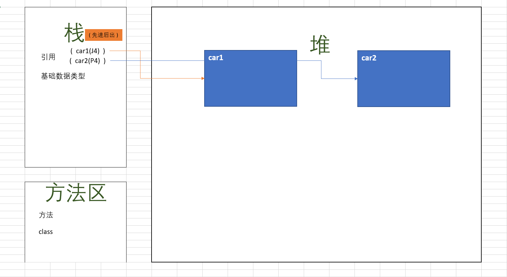

### 内存分析

- java文件加载到内存的过程:
  - 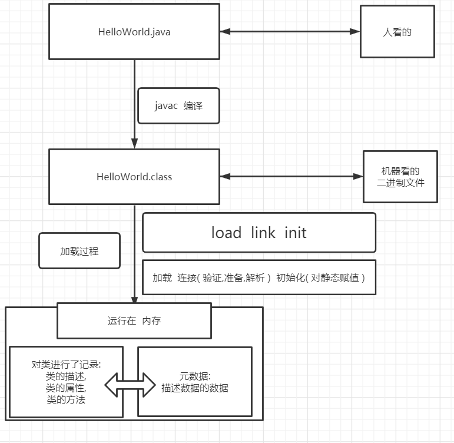
  
- 栈 堆 元数据区 基本原理
  - 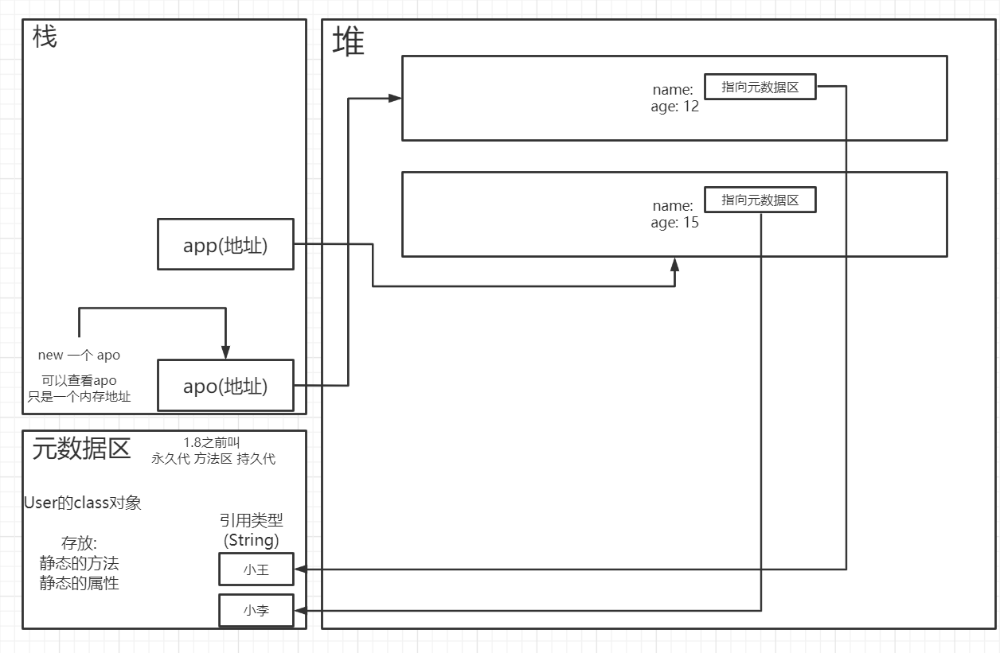

- 实战分析
  - 代码块先奉上,有点绕
  - 代码结构
  - 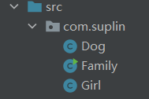
  - Girl.java
  ```java
      package com.suplin;

      /**
      * @author 林一
      * @data 2021/4/27
      */
      public class Girl {

          /*
          * 静态变量的写法: 全部大写  遇到多个单词,用下划线连接
          * 为 引用数据类型 String  所以默认值为null
          */

          public static String MY_BOYFRIEND;

          private int age;
          private String name;

          //
          private Dog dog;


          // 构造方法
          public Girl(int age, String name) {
              this.age = age;
              this.name = name;
          }
          public Girl(){};

          // 普通方法
          public void keepPet(){
              System.out.println(this.age + "岁的" +this.name + "养了一条狗,叫做" + dog.getName());
          }

          // 静态方法
          public static void meet(String name){
              System.out.println(name + "和" + MY_BOYFRIEND + "约会去了");
          }


          public int getAge() {
              return age;
          }

          public void setAge(int age) {
              this.age = age;
          }

          public String getName() {
              return name;
          }

          public void setName(String name) {
              this.name = name;
          }

          public Dog getDog() {
              return dog;
          }

          public void setDog(Dog dog) {
              this.dog = dog;
          }
      }
  ```

  - Dog.java
  ```java
  package com.suplin;

  /**
   * @author 林一
   * @data 2021/4/27
   */
  public class Dog {
      private String name;

      public Dog(String name) {
          this.name = name;
      }

      public String getName() {
          return name;
      }

      public void setName(String name) {
          this.name = name;
      }
  }

  ```

  - Family.java
  ```java
  package com.suplin;

  /**
   * @author 林一
   * @data 2021/4/27
   */
  public class Family {
      public static void main(String[] args) {

          int age = agePlus(4,5);

          Dog dog = new Dog("teddy");

          // ------------用有参构造方法构造
          Girl lanlan = new Girl(age,"lanlan");

          // ------------用无参构造方法进行设置
  //        lanlan.setAge(age);
  //        lanlan.setName("lanlan");

          // 设置 Girl 的 dog 属性,将dog 传入
          lanlan.setDog(dog);

          lanlan.keepPet();

          Girl.MY_BOYFRIEND = "彭于晏";

          Girl.meet(lanlan.getName());

      }
      public static int agePlus(int i , int j){
          int a = i + j;
          return a;
      }
  }

  ```

  - 内存图
    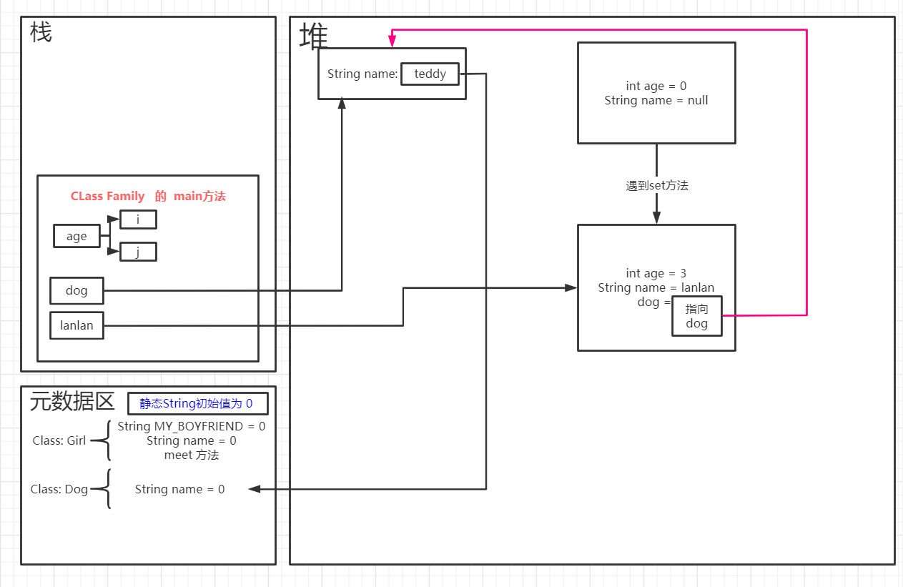

### 引用传递 和 值传递

- 先看代码:
```java
package com.supyi;

/**
 * 
 * @author 林一
 * @data 2021/4/27
 */
public class Zhi {
    public static void main(String[] args) {

        // ****引用传递

        int[] nums = {2,3,7,1,4};
        // 因为是普通方法,所以得new一个对象,不能直接使用
        Zhi data = new Zhi();
        data.sort(nums);

        for (int num : nums) {
            System.out.println(num);
        }

        System.out.println("***********");


        // ****值传递

        int a =1;
        int b =2;
        plus(a,b);

        System.out.println(a);
        // 会发现打印的 a 没有变化,还是1


    }


    public void sort(int[] data){
        for (int i = 0; i < data.length - 1; i++) {
            for (int j = 0; j < data.length - 1 - i; j++) {
                if (data[j] > data[j+1]){
                    int temp = data[j];
                    data[j] = data[j+1];
                    data[j+1] = temp;
                }
            }
        }
    }


    public static void plus(int i , int j){
        i = i+j;
    }


}

```


- 会发现,数组进行了排序,打印数组,则是变化了的数组
- 但是,将 a+b 赋值给 a , 打印a,a却还是原来的那个值
-
- 引用传递
  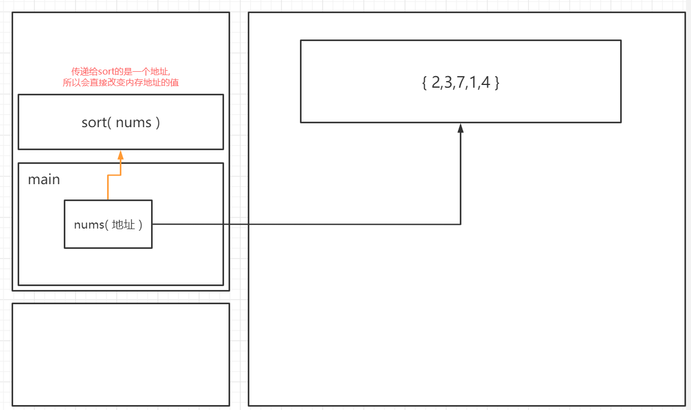
- 
- 值传递
  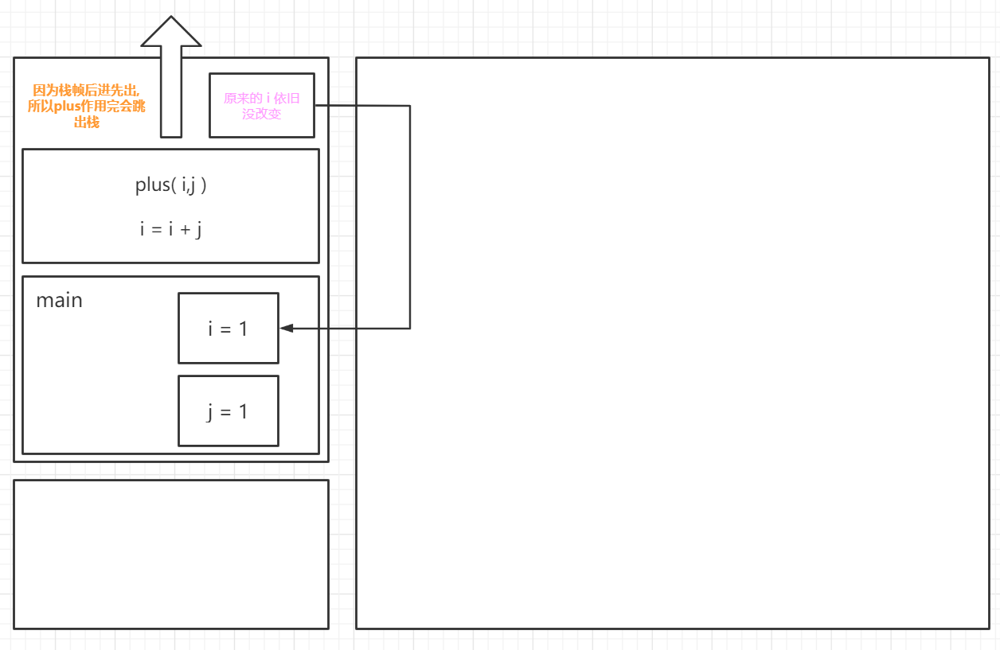


### 成员变量 和 局部变量

- 成员变量 ,如 属性 一旦设置了 便有一个默认值:如下

```java
package com.suplin;

/**
 * @author 林一
 * @data 2021/4/26
 */
public class User {


    public static void main(String[] args) {
        User user = new User();

        System.out.println(user.getAge());
        System.out.println(user.getLonger());
        System.out.println(user.getName());
        System.out.println(user.getHeight());
        
        // boolean 型,就不是  getFat  了,而是  isFat
        System.out.println(user.isFat());
    }

    /*
     * 属性  ---->   为成员变量
     * 成员变量  设置后有   初始值
     */

    private int age;
    private String name;
    private double longer;
    private boolean fat;
    private float height;

    public User(int age, String name, double longer) {
        this.age = age;
        this.name = name;
        this.longer = longer;
    }

    public User() {
    }

    public int getAge() {
        return age;
    }

    public void setAge(int age) {
        this.age = age;
    }

    public String getName() {
        return name;
    }

    public void setName(String name) {
        this.name = name;
    }

    public double getLonger() {
        return longer;
    }

    public void setLonger(double longer) {
        this.longer = longer;
    }

    public boolean isFat() {
        return fat;
    }

    public void setFat(boolean fat) {
        this.fat = fat;
    }

    public float getHeight() {
        return height;
    }

    public void setHeight(float height) {
        this.height = height;
    }
}

```

```cmd
0
0.0
null
0.0
false
```
- 局部变量,需要手动初始化值
  - 不管是基础数据类型,还是引用数据类型,都需要手动初始化
  

### 方法的递归
> 通过压栈和弹栈来实现递归操作

- 以斐波那契数列来举例
  ```java
    package com.supyi;

    /**
    * @author 林一
    * @data 2021/4/27
    */
    public class Fibonacci {
        public static void main(String[] args) {
            System.out.println(fibonacci(3));
        }

        public static int fibonacci(int count){
            if (count == 1){
                return 0;
            }
            if (count == 2){
                return 1;
            }
            if (count < 1){
                return -1;
            }
            return fibonacci(count-1) + fibonacci(count-2);

        }
    }

  ```


内存分析展示(count = 3) 简单版
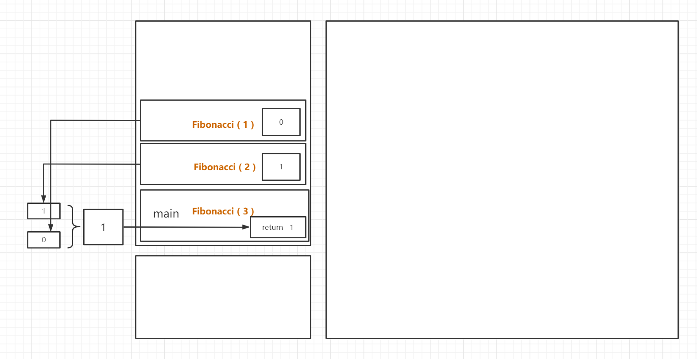

### 初始化
> 定义后会有初始值

- 静态变量会被初始化
- 成员变量会被初始化
- 局部变量(写在方法里头)不会被初始化
- 
- 引用数据类型初始值为 null
- 基础数据类型初始值为 0,0.0,false,...

## 封装

- 类包括了**属性**和**方法** 
  - 类
    - 类似于车的说明书,即车的描述,有了描述才能创造对象
  - 属性
    - 类似于车的颜色,大小等属性
  - 方法
    - 类似于车的功能,例如它可以开动

- 使用
```java
/**
 * @author 林一
 * @data 2021/4/25
 */
public class Car {
    public String color;
    public int saddle;

    public void run(){
        System.out.println("启动");
        System.out.println("出发");
    }

    public static void main(String[] args) {
        // 创建对象
        Car car = new Car();
        car.color = "red";
        car.saddle = 4;
        car.run();

        System.out.println("***************");

        // 说明书依旧可以创建更多的对象
        Car car1 = new Car();
        car1.saddle = 6;
        car1.color = "pink";
        car1.run();

    }
}

```

```cmd
启动
出发
***************
启动
出发

```

### 包 的概念和命名规则

- 结构
  


- 包的命名
  
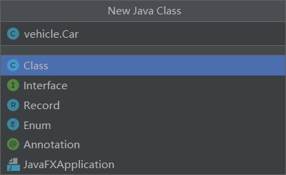

- 导包
    - 同一个包里面的类直接import 类
    - 不同的包则import 包名.类
    - 若还需要导入类里面的方法,则import 包名.类.方法名

- 国际惯例 包的命名
    - 为了唯一性:则使用域名的倒置
    - 图例
    - 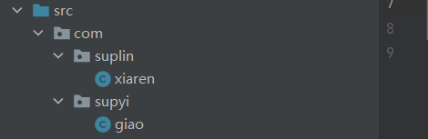
    - 包的名字都是小写,类的名字都是驼峰命名

### 权限修饰符
| 作用域 | 当前类 | 同package(包) | 子孙类 | 其他package(包) |
| :---:| :---: | :---: | :---: | :---: |
| public | √ | √ | √ | √ |
| protected | √ | √ | √ | × |
| friendly(default) | √ | √ | × | × |
| private | √ | × | × | × |

1. 包 是指距离自己最近的包
2. 不写就是默认 friendly

### 构造方法

1. 构造方法 只有个 public 和方法名 并且构造方法的名字跟类名一致
2. new 其实是在调用构造方法
3. 如果一个类里边没有构造方法 会自己创建一个空的构造方法
4. 空的构造方法 有默认值: 0 false null 0.0
5. 构造方法能传参数,在构造期间就需要把对象的形参写上
6. 一旦有了新的有参数的构造方法,空构造方法就不在了
7. 如果想有空构造方法,就需要自己手动打上


- this关键字
  - 指的就是**内存里分配好空间的对象本身**
  - 即**堆区**里的
  - 而没有this 的,则是变量
  - 

### 重载

1. 方法名相同(重)
   ```java
   public Dog(){};
   public Dog(String name,int age){};

2. 方法的参数类型，参数个不一样(重)
   ```java
   public Dog(String name,int age){};
   public Dog(String name,int age,int height){};

3. 方法的返回类型可以不相同
   ```java
   public void print(){
       System.out.println("***")
   };
   public int print(){
       return 1
   }
4. 方法的修饰符可以不相同
   ```java
   public Dog(String name,int age){};
   private Dog(String name,int age,int height){};
5. main 方法也可以被重载

### 完整的类
```java
package text2;

/**
 * @author 林一
 * @data 2021/4/26
 */
public class Girl {

    /*
     * 属性
     * 用private,则外包就不能使用
     * 旨在为了更好的设置值,例如,在下面 setAge 所示
     */

    private int age;
    private String name;
    private int height;

    // 构造方法

    public Girl(){}; // 无参构造,则需要附加给属性一些值,用setXXX来设置


    public Girl(int age,String name,int height){  // 有参构造,则不需要赋值了,直接传进参数,直接使用
        this.age=age;
        this.height=height;
        this.name=name;
    };

    // 普通方法
    public void meet(String name,int age){
        makeUp();
        System.out.println(age + "岁的" + name + "觉得年龄为" + this.age + "的,身高为" + this.height + "米的" + this.name + "好美!");
    }

    // 私有方法
    private void makeUp(){
        System.out.println("今天化了美美的妆");
    }

    // 还有一些方法


    public void setAge(int age) {
        this.age = age;
    }

    public int getAge() {
        if (this.age > 18){
            return 18;
        }
        return age;
    }

    public void setHeight(int height) {
        this.height = height;
    }

    public int getHeight() {
        return height;
    }

    public void setName(String name) {
        this.name = name;
    }

    public String getName() {
        return name;
    }
}

```

- 如何使用:

```java
package text1;

import text2.Girl;

/**
 * @author 林一
 * @data 2021/4/26
 */
public class Meet {
    public static void main(String[] args) {

        // 使用无参构造,则需要自己设置参数
        Girl girl = new Girl();
        girl.setAge(19);
        girl.setName("fangfang");
        girl.setHeight(29);
        girl.meet("猪八戒",20);

        // 验证用 private 限制属性的好处,可以在设置值时 更加方便管理
        System.out.println(girl.getAge());

        // 使用有参构造,则不需要设置了,只需要在new 的时候传入即可
        Girl fangfang = new Girl(19,"aiai",1);
        fangfang.meet("孙悟空",13);

    }
}

```

- 包之间的结构
  
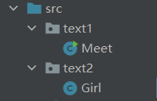

### 包装类
基本数据类型|包装类|
:---:|:---:|
byte|Byte|
short|Short|
int|Integer|
long|Long|
float|Float|
double|Double|
char|Character|
boolean|Boolean|

> 包装类在  堆  ; 基本数据类型在  栈  .

> 在堆里面的包装类 比 基本数据类型多了一个值 ---->  null

- 自动装拆箱
```java
/*
 * 自动装箱
 * 将 基本数据类型 转换成 引用数据类型
 */
Integer num = 0;
/*
 * 自动拆箱
 * 将 引用数据类型 转换成 基本数据类型
 */
int temp = num;
```

- 包装类 的常见用法:
```java
// 找出两个数中的最大值
int max = Integer.max(2,5);
// 字符串 转 int类型
int num = Integer.parseInt("333")
```

### 包装超级数据
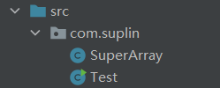

- SuperArray
```java
package com.suplin;

/**
 * @author 林一
 * @data 2021/4/27
 */
public class SuperArray {
    private int[] array;

    // 定义下标
    private int currentIndex = -1;


    public SuperArray(int size) {
        array = new int[size];


    }

    public SuperArray() {
        // this 指的就是上面的构造方法
        this(10);
    }


    // 排序
    public void sort(){
        for (int i = 0; i < currentIndex; i++) {
            for (int j = 0; j < currentIndex -i; j++) {
                if(array[j] > array[j+1]){
                    int temp = array[j];
                    array[j] = array[j+1];
                    array[j+1] = temp;
                }
            }
        }

    }


    public SuperArray add(int data){

        /* add 一个,光标就会在最后最后add的那个位置上,
         * 例如 最开始,光标是 -1 然后 add(2) 添加了一个值,则 -1 + 1 = 0 0号位则是最后的位置
         */
        currentIndex++;
        // 只要添加了数值,那么光标就一定会在最新的那个值上面,即最后的位置上(序列号,不是个数号)

        // 扩容
        if (currentIndex >= array.length){
            int[] temp =new int[array.length*2];
            for (int i = 0; i < array.length; i++) {
                temp[i] = array[i];
            }
            array = temp;
        }
        // 此时光标在有数值的最后一位的后一位,将新数值赋值上去即可
        array[currentIndex] = data;
        return this;


    }

    // 删除第几个数
    public void delete(int index){
        if (index < 0 || index > currentIndex){
            System.out.println("参数不合法");
            return;
        }
        // 将删除的那个位置的后面全部往前移一位,最后的 i 要小于 length-1 不然,array(i+1) 就会越界
        for (int i = index-1; i < array.length-1; i++) {
            array[i] = array[i+1];
        }
        // 游标移动到最后一个位置的前一个,因为数组少了一个数
        currentIndex--;

    }


    public void print(){
        System.out.println("******结果******");

        for (int i = 0 ;i <= currentIndex;i++) {
            System.out.print(array[i] + " ");
        }
        System.out.println();
    }

    public String toStr(){
        String res = "";
        for (int i = 0; i <= currentIndex; i++) {
            if (i == currentIndex){
                res += array[i];
            }else {
                res += array[i] + ",";
            }
        }
        return res;
    }

    public int[] get(){
        return array;
    }


}

```

- test
```java
package com.suplin;

/**
 * @author 林一
 * @data 2021/4/27
 */
public class Test {
    public static void main(String[] args) {
        // 不加参数,则调用无参构造,默认会申请 10 个位置
        SuperArray  superarray =new SuperArray();

        // 因为在 add 方法最后 return 的是this 就是自己,所以可以自己  add
        superarray.add(5).add(6).add(74).add(9);

        // 个数是有一个currentIndex来实现跟踪,这个个数不比长度,如果输入的值大于我的个数,那就会有 语句输出
        superarray.delete(1);

        superarray.print();

//        System.out.println(superarray.get());

        // 将array 装换成 字符型, 因为任何类型 加 "" 即字符型,然后加了","输出
        System.out.println(superarray.toStr());


    }
}

```

## 继承


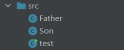

- Father
```java
/**
 * @author 林一
 * @data 2021/4/28
 */
public class Father {

    // private 不能在父子类间传递
    protected String hobby;

    public void smoke(){
        System.out.println("我爱抽中华");
    }

    
    public String getHobby() {
        return hobby;
    }
    public void setHobby(String hobby) {
        this.hobby = hobby;
    }
}

```

- Son
```java
/**
 * @author 林一
 * @data 2021/4/28
 */
public class Son extends Father{
        public void getH(){
            System.out.println("我是儿子,但是我的爱好也是" + hobby);
        }

}

```

- Test
```java
/**
 * @author 林一
 * @data 2021/4/28
 */
public class test {
    public static void main(String[] args) {

        // 建个对象
        Son son =new Son();
        //继承了父代的smoke方法
        son.smoke();
        // 这里setHobby也是父代的方法
        son.setHobby("踢足球");
        System.out.println(son.getHobby());
        // 这里是子代的方法,用来验证 protected 可以将 父代 属性传递到 子代属性
        son.getH();

    }
}

```

### 重写

- 子类若想写一样的方法,则
  ```java
  // 这个是注解 
  @Override
  public void smoke(){
      System.out.println("我爱抽雪茄");
  }
  ```

- 在test里```son.smoke();```则不会出现父代的`smoke`方法,输出为
  ```cmd
  我爱抽雪茄
  ```

- 内存分析
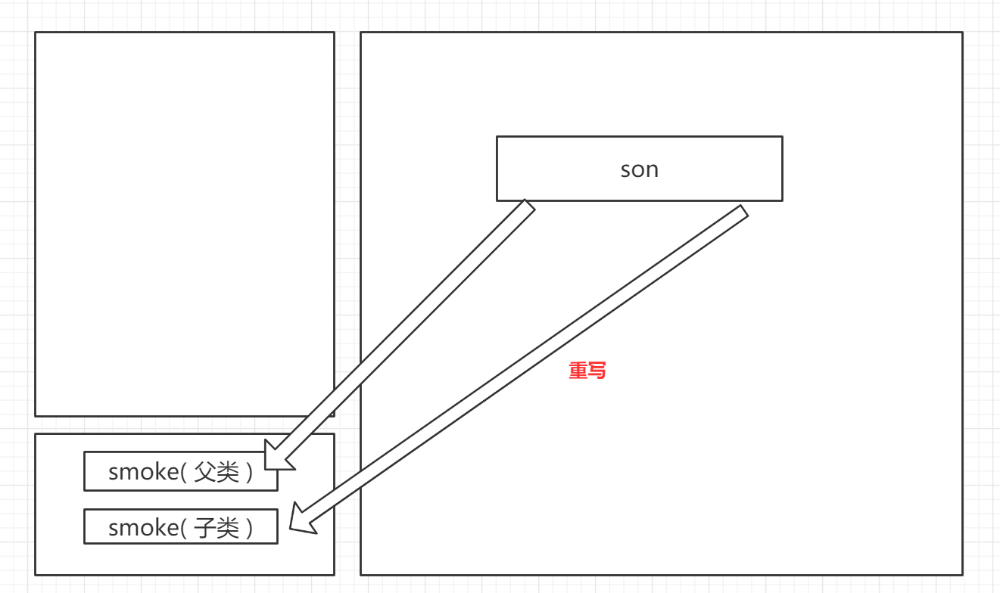

### 子类构造
- 为了在用了重写后任可以使用父类的方法 可以在方法前加super.(超类)
  ```java
  super.smoke();
  ```

- 为了验证子类在继承父类时,调用了父类的空参构造,这样
- Father
  
```java
public Father() {
    System.out.println("构造了空参构造");
}
```

- test
```java
Son son =new Son();
```

- cmd
```cmd
构造了空参构造
```

### 所有的类 都继承了一个顶级父类:
#### object

### 字父类构造器问题
> 在用构造器的时候,其实调用了父类的构造<br>
> 实际上在构造方法的时候调用了super ,被隐藏了罢了

    ```java
    public Son(){
        super();
    }
    ```

> 在单独一个类的时候,写构造方法的时候,调用了顶级父类的构造(object)


> 因为 在写了有参构造的时候,无参构造会被覆盖<br>
> 所以要让构造成功 就应该写上  **父类构造器**:

```java
public Son(){
    super("***")
}
```

> 且这个 父类构造器 必须第一行首先构造父类

> this 指向自己<br>
> super 指向父类


  
### 类的加载过程
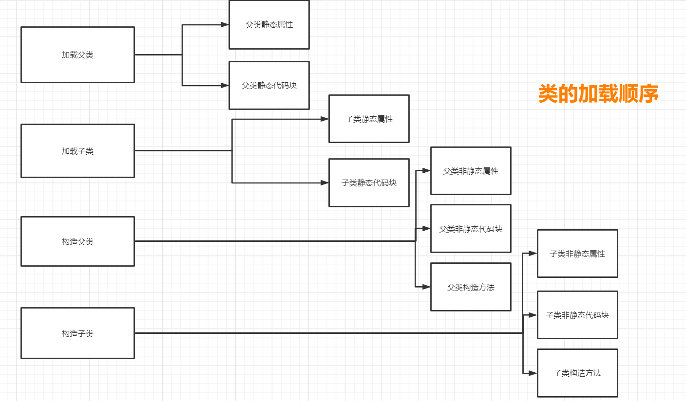

- 文件结构
  - 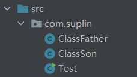

- ClassFather

```java
package com.suplin;

/**
 * @author 林一
 * @data 2021/4/28
 */
public class ClassFather {

    public static String NAME = "父类静态属性";

    // 代码块
    static {
        System.out.println("这是" + NAME);
        System.out.println("这是父类静态代码块");
    }


    public String STR = "父类非静态属性";

    // 代码块
    {
        System.out.println("这是" + STR);
        System.out.println("这是父类非静态代码块");
    }

    // 构造方法
    public ClassFather() {
        System.out.println("这是父类构造方法");
    }
}

```

- ClassSon
  
```java
package com.suplin;

import java.util.logging.FileHandler;

/**
 * @author 林一
 * @data 2021/4/28
 */
public class ClassSon extends ClassFather {

    public static String NAME = "子类静态属性";

    // 代码块
    static {
        System.out.println("这是" + NAME);
        System.out.println("这是子类静态代码块");
    }


    public String STR = "子类非静态属性";

    // 代码块
    {
        System.out.println("这是" + STR);
        System.out.println("这是子类非静态代码块");
    }

    // 构造方法
    public ClassSon() {
        System.out.println("这是子类构造方法");
    }
}

```

- Test
```java
package com.suplin;

/**
 * @author 林一
 * @data 2021/4/28
 */
public class Test {
    public static void main(String[] args) {
        ClassSon son = new ClassSon();

    }
}
```

```cmd
这是父类静态属性
这是父类静态代码块
这是子类静态属性
这是子类静态代码块
这是父类非静态属性
这是父类非静态代码块
这是父类构造方法
这是子类非静态属性
这是子类非静态代码块
这是子类构造方法
```

### 引用数据类型比较
在堆里面的东西进行比较,则会不同,例如
```java
String a = new String("a");
String b = new String("b");
System.out.println(a == b);
```
```cmd
false
```
但是有一个例外:
```java
String a ="a";
String b ="a";
System.out.println(a == b);
```
```cmd
true
```

- 任何引用类型不能 == 判断值是否相等,而是要用 equals 方法
- 但是 equals 不能满足 子类的需求,就需要在父类那里重写 equals .

1. 在父类里头创建一个属性,然后快捷添加 set和get 然后弄一个 构造方法
   ```java
    public Father(String hobby) {
        this.hobby = hobby;
    }

    public String hobby;

    public String getHobby() {
        return hobby;
    }

    public void setHobby(String hobby) {
        this.hobby = hobby;
    }

  ```

2. 在子类里头 就直接继承父类就行了 弄一个构造方法 然后super一下
   ```java
    public Son(String hobby) {
        super(hobby);
    }
  ```

3. 然后就需要在father里头重写 equals 方法了
   ```java
    @Override
    public boolean equals(Object obj) {

        // 给到一个 father 对象
        Father father;
        // 如果 传入的对象 ∈ Father   为什么不能写 Son 因为,如果传进的是Father new的对象,那就不能做判断了,但是写Father Son new的对象就行
        if (obj instanceof Father){
            // 将 obj 强转成 Father 
            father = (Father) obj;
            // 然后比较 两者的 hobby 这里的 equals 就是 == 的意思
            if (this.getHobby().equals(father.getHobby())){
                return true;
            }
        }
        return false;
    }
   ```

    0. 这里头有几个知识点:
    1. instanceoF 的意思 跟 ∈ 的意思一样 , 判断着 子父类 之间的关系
    2. equals 的意思 他里面的源码 就是 == 判断两个值是否相等
    3. this 指的是使用这个方法的 对象
   
4. test
   ```java
    package com.suplin;

    /**
    * @author 林一
    * @data 2021/4/28
    */
    public class Test {

        public static void main(String[] args) {
            Father father1 = new Father("抽");
            Father father2 = new Father("抽烟");
            System.out.println(father1.equals(father2));


            Son son1 = new Son("抽烟");
            Son son2 = new Son("抽烟");
            System.out.println(son1.equals(son2));
        }

    }

   ```
   ```cmd
    false
    true
   ```

### toString 和 hashCode

- toString:
  - 将内容转成 更容易看的字符串
- hashCode:
  - 将内容转成 一串数字
- 有必要时,要重写toString 和 hashCode


### 类型强转
- 父类引用 --> 子类引用 : 向下转型
- 子类引用 --> 父类引用 : 向上转型


## 多态
- 好处
  - 易于拓展
- 条件
  - 1. 有继承
  - 2. 有重写
  - 3. 父类引用指向子类对象

### 抽象类 和 抽象方法
- 抽象类
  - 在类 class 前加入abstract 该类就是抽象类  
  - 抽象类内 既可以有抽象方法,也可以有已经实现了的
- 抽象方法
  - 在方法void 前加入abstract 该方法就是抽象方法 抽象方法不需要有 {} 的实现
- 但是他的子类对象必须重写他的 抽象方法 此时 就不叫重写了 叫实现
- 这时 抽象方法更像是一种约定,一种规则
  

### 接口
- 如果这个类所有的方法都是抽象方法,那么这个类就叫接口
- 接口的模板:
  ```java
    public interface Animal(){
        /*
         * 定义了呼吸
         */

        void breathe();

        /*
         * 定义了吃
         */

        void eat();

    }
  ```
  ```java
  public class Cat implements Animal(){
      @Override
      public void breathe(){
          System.out.println("猫在用鳃呼吸")
      }
      @Override
      public void eat(){
          System.out.println("猫在吃鱼")
      }
  }
  ```
  ```java
  public class Dog implements Animal(){
      @Override
      public void breathe(){
          System.out.println("狗用鼻子呼吸")
      }
      @Override
      public void eat(){
          System.out.println("狗在吃草")
      }
  }
  ```
  ```java
    public static void main(String[] args) {
        // 或者 Animal animal = new Cat();
        // 直接改后面子代的类名,后面的方法不用变,拓展性很强
        Animal animal = new Dog();
        animal.eat();
    }
  ```


### 超级数组 和 超级链表 实现多态
#### 实现多态
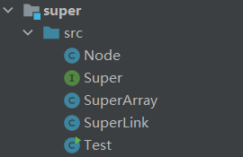

- Node(链表------数据结构)
  
```java
/**
 * @author 林一
 * @data 2021/4/29
 */
public class Node {

    /*
     * 具体存入的数据
     */

    private int data;

    /*
     * 指向下一个节点的引用
     */

    private Node next;

    public Node() {}

    public Node(int data, Node next) {
        this.data = data;
        this.next = next;
    }

    public int getData() {
        return data;
    }

    public void setData(int data) {
        this.data = data;
    }

    public Node getNext() {
        return next;
    }

    public void setNext(Node next) {
        this.next = next;
    }

    @Override
    public String toString() {
        return "Node{" +
                "data=" + data +
                ", next=" + next +
                '}';
    }
}
```

- Super
  
```java
/**
 * @author 林一
 * @data 2021/4/29
 */
public interface Super<T> {


    void add(T data);
    void update(int index,T newdata);
    void delete(int index);
    void print();
    T get(int index);
    int size();

}
```

- SuperArray

```java
/**
 * @author 林一
 * @data 2021/4/27
 */

public class SuperArray<T> implements Super<T> {


    // 想存什么就存什么
    private Object[] array;

    // 定义下标
    public int currentIndex = -1;


    public SuperArray(int size) {
        array = new Object[size];

    }

    public SuperArray() {
        // this 指的就是上面的构造方法
        this(10);
    }


    @Override
    public void add(T data){

        /* add 一个,光标就会在最后最后add的那个位置上,
         * 例如 最开始,光标是 -1 然后 add(2) 添加了一个值,则 -1 + 1 = 0 0号位则是最后的位置
         */
        currentIndex++;
        // 只要添加了数值,那么光标就一定会在最新的那个值上面,即最后的位置上(序列号,不是个数号)

        // 扩容
        if (currentIndex >= array.length){
            Object[] temp =new Object[array.length*2];
            for (int i = 0; i < array.length; i++) {
                temp[i] = array[i];
            }
            array = temp;
        }
        // 此时光标在有数值的最后一位的后一位,将新数值赋值上去即可
        array[currentIndex] = data;

    }

    @Override
    public void update(int index,T newdata){
        array[index] =newdata;
    }

    // 删除第几个数
    @Override
    public void delete(int index){
        if (index < 0 || index > currentIndex){
            System.out.println("参数不合法");
            return;
        }
        // 将删除的那个位置的后面全部往前移一位,最后的 i 要小于 length-1 不然,array(i+1) 就会越界
        for (int i = index; i < array.length-1; i++) {
            array[i] = array[i+1];
        }
        // 游标移动到最后一个位置的前一个,因为数组少了一个数
        currentIndex--;

    }

    @Override
    public void print(){
        System.out.println("******结果******");

        for (int i = 0 ;i <= currentIndex;i++) {
            System.out.print(array[i] + " ");
        }
        System.out.println();
    }


    @Override
    public T get(int index){
        return (T) array[index];
    }

    @Override
    public int size() {
        return currentIndex;
    }


}


```
- SuperLink
```java
/**
 * @author 林一
 * @data 2021/4/29
 */
public class SuperLink<T> implements Super<T> {

    private Node head;
    private int size;


    /*
     * 从头部添加数据
     * 三个步骤: 用一个newHead来临时存储数据,然后将其指向旧头,然后让自己成为新头
     */
    @Override
    public void add(T data){
        // 让 newHead 变成头
        Node newHead = new Node(data,null);

        // 让新的头指向旧的头
        newHead.setNext(head);

        // 让 head 指向 newHead
        head = newHead;
        size++;


    }

    // 抽离方法 --->  拿到对应序列号的 node
    private Node getNode(int index){
        Node node = head;
        for (int i = 0; i < index; i++) {
            node = node.getNext();
        }
        return node;
    }

    // 拿到对应序列号node的数值
    @Override
    public T get(int index){
        return (T)(getNode(index).getData());
    }

    @Override
    public int size() {
        return size;
    }

    // 删除对应序列号node的数值
    @Override
    public void delete(int index){
        if (index == 0){
            Node node = getNode(index);
            head = node.getNext();
        }else{
            Node node = getNode(index-1);
            node.setNext(node.getNext().getNext());
        }
        size--;
    }

    // 修改数据
    @Override
    public void update(int index, T newData){
        Node node = getNode(index);
        node.setData(newData);
    }


    @Override
    public void print(){

        // 定义一个指针, 以防止污染 head
        Node node = head;

        // 遍历数值,当这个 node 为null 时,即最后一个的下一个,便不循环打印
        while (node != null){
            System.out.println(node.getData());
            node = node.getNext();
        }
//        System.out.println(node.getData());

    }

    @Override
    public String toString() {
        return "SuperLink{" +
                "head=" + head +
                '}';
    }


    /*
     * 这里是内部类 这里是内部类 这里是内部类 这里是内部类
     * 这里是内部类 这里是内部类 这里是内部类 这里是内部类
     * 这里是内部类 这里是内部类 这里是内部类 这里是内部类
     * 这里是内部类 这里是内部类 这里是内部类 这里是内部类
     */


    private static class Node<T> {

        /*
         * 具体存入的数据
         */

        private T data;

        /*
         * 指向下一个节点的引用
         */

        private Node next;

        public Node() {}

        public Node(T data, Node next) {
            this.data = data;
            this.next = next;
        }

        public T getData() {
            return data;
        }

        public void setData(T data) {
            this.data = data;
        }

        public Node getNext() {
            return next;
        }

        public void setNext(Node next) {
            this.next = next;
        }

        @Override
        public String toString() {
            return "Node{" +
                    "data=" + data +
                    ", next=" + next +
                    '}';
        }
    }

}

```

### 泛型类
用 T,等几个大写字母来代替需要用的类型<br>
有点小难,不想笔记

## this super
- 实例: new 出来的那个就是实例对象
- this: 指向本实例
- super: 指向父类的实例

# 内部类
在类里面写个类,定义成private static,让其变成只能本类用的类
- 使用
```java
// 非静态内部类
SuperLink superlink = new SuperLink();
SuperLink.Node node = superlink.new Node();

// 静态内部类
SuperLink.Node node = new SuperLink.Node();
```

### 匿名内部类
- 正常本来应该写这个结构的
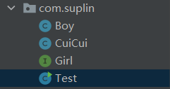<br>
- 然后本应该在Test里面写这个
```java
public class Test {
    public static void main(String[] args) {
        Boy boy = new Boy();
        CuiCui cuicui = new CuiCui();
        boy.married(cuicui);
    }
}
```

- 换成内部类  可以:
    - 把CuiCui写进Test里头
    - 就是这样
    ```java
    public class Test {
    public static void main(String[] args) {
        Boy boy = new Boy();
        CuiCui cuicui = new CuiCui();
        boy.married(cuicui);
    }
    private static class CuiCui implements Girl{
        @Override
        public String name() {
            return "翠翠";
        }
    }
    }
    ```

- 换成匿名内部类  也可以
    - 压根不需要写CuiCui类来继承
    - 可以直接new 一个 接口( 一般new 一个对象是没有右面的代码块的,但是这里的匿名对象类有)
    ```java
    Girl girl  = new Girl() {
        @Override
        public String name() {
            return "翠翠";
        }
    };
    ```
    - 然后就可以直接将 girl 传进married 里头
    - 这就是匿名内部类


# 打 jar 包
- 步骤
    1. shift + ctrl + alt + s 打开project structure
    2. 点 Artifacts
    3. 点+ ---> 点jar ---> from module ---> 选择一个module ---> 一路apply
    4. 点上面的 Build ---> Build Artifacts
    5. 在 out 那里就可以看到 jar 包了

- 使用 jar 包
    1. shift + ctrl + alt + s 打开project structure
    2. 点 Libraries ---> 点+ ---> 点到自己的 jar 包就行了

# 栈 和 队列 (数据结构)
FIFO(first in first out) -----> 队列
FILO(first in last out) -----> 栈

## 银行取票器
- 超级数组和超级链表 参考上文的<<超级数组 和 超级链表 实现多态>>
- 文件结构
  
- Bank
  ```java
    package newSuper.src.com.suplin;

    import java.util.Scanner;

    /**
    * @author 林一
    * @data 2021/5/1
    */
    public class Bank {
        public static void main(String[] args) {
            Queue<Integer> queue = new Queue<>();
            int startNumber = 1;
            System.out.println("请输入您的名字:");

            while (true){
                // 号码输入: 从 1 到 5
                for (int num = startNumber; num < startNumber + 5; num++) {
                    queue.put(num);
                }

                // 如果队列里面的号码还有,就一直输出队列 如果没有,就到 +5 的那一步
                while (queue.isNotEmpty()){
                    Scanner scanner = new Scanner(System.in);
                    String name = scanner.next();
                    System.out.println(name + "朋友,您的号码是" + queue.take());
                }

                // 将号码 增加个 5 , 即下一次是  号码输入 6 到 10
                startNumber += 5;
            }
        }
    }

  ```

- Queue
  ```java
    package newSuper.src.com.suplin;

    import newSuper.src.SuperArray;

    /**
    * @author 林一
    * @data 2021/5/1
    */
    public class Queue<T> {
        SuperArray<T> superArray  = new SuperArray<>();

        // 入栈
        public void put(T data){
            superArray.add(data);
        }

        // 出栈
        public T take(){
            if (superArray.size() >= 0) {
                // 将队列第 0 号位赋值到 temp
                T temp = superArray.get(0);
                // 删除掉这个 0 号位
                superArray.delete(0);
                // 返回这个 temp
                return temp;
            } else {
                return null;
            }
        }


        public boolean isNotEmpty() {
            //  判断这个数组的长度是否等于 0
            return superArray.size() != 0;
        }
    }

  ```

- Stack
  ```java
    package newSuper.src.com.suplin;

    import newSuper.src.SuperArray;

    /**
    * @author 林一
    * @data 2021/5/1
    */
    public class Stack<T> {
        SuperArray<T> superArray  = new SuperArray<>();

        public void put(T data){
            superArray.add(data);
        }

        public T pop(){
            if (superArray.size() >= 0) {
                // 可以通过这个 SuperArray 类查看里面的size方法,是一个返回最后一个值的下标的方法
                T temp = superArray.get(superArray.size());
                superArray.delete(superArray.size());
                return temp;
            } else {
                return null;
            }
        }


    }

  ```

# final 和 static
## final 定义了的常量,不能被修改
- final修饰的类不能被继承,被final修饰的方法不能被重写,被final修饰的属性不能被修改
- 快捷键:
  - `psfi` 为int 类型
  - `psfs` 为String 类型
- ```java
    public static final int AGE = 2;
    public static final String NAME = "linhui";
  ```
## static 
- 如果定义成属性,则该属性通常当作常量使用
- 如果定义成方法,则该方法通常当作工具使用

# 写单元测试用例
1. 新建包
2. 新建一个类,并以Test结尾:***Test
3. 在方法上面写个 @Test
4. 如果报红,就alt + enter 导包
5. 例如:
- 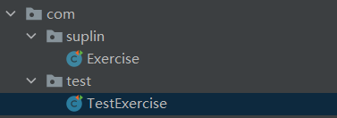

- Exercise
```java
    package com.suplin;

    import org.junit.Test;

    /**
    * @author 林一
    * @data 2021/5/2
    */
    public class Exercise {
        @Test
        public void Test(){
            System.out.println("练习");
        }

    }

```

- TestExercise
```java
package com.test;

import com.suplin.Exercise;
import org.junit.Test;

/**
* @author 林一
* @data 2021/5/2
*/
public class ExerciseTest {

    @Test
    public void func(){
        Exercise exercise = new Exercise();
        exercise.Test();
    }
}

```

# 集合

## 集合--list

### ArrayList

```java
List<Integer> list = new ArrayList<>();
```

- 添加元素: list.add() 
- 查看第几个序列号: list.get()
- 删除第几个序列号: list.remove()
  - 如果要删除指定的数,则会有很多坑
    ```java
    // 如果使用for循环,判断里面的数字是不是这个,再删除,则是这样
    for (int i = 0; i < list.size(); i++) {
        if (list.get(i) == 7){
            list.remove(i);
        }
    }
    ```
  - 就会发现,如果两个连着的数字相同,只会删除一个,这是因为数组的方法里面,实现了如果删除一个,后面的数会往前挪,所以再遍历下一个的时候,实则遍历到原数组的下两个的那个数了,就跳跃了一个
  - 但是可以有一个方法,即指针前挪一个,即i--
    ```java
    for (int i = 0; i < list.size(); i++) {
        if (list.get(i) == 7){
            list.remove(i);
            i--;
        }
    }
    ```
- 删除传进来的对象(但是如果要删除相同的值,就得在自制的方法中重写equals方法,因为equals默认比较的是内存地址): list.remove()
- 删除集合(因为removeAll是顶级父类的方法,所以可以删除子类的东西): list.removeAll()
- 删除全部: list.clear()
- 判断是否存在(也须重写equals): list.contains()
- 查看传进的东西的下标: list.indexOf()
- 修改: list.set()

### LinkedList

`List<Integer> list = new ArrayList<>();` 跟上面ArrayList一样的方法, 因为接口一样

### java是个单继承但是可以多实现的语言,即只能继承一个父类但是可以实现多个接口

## 集合--map (最重要)
`Map<String,Integer> map = new HashMap<>();`
### 常见的两个方法:
- 添加:
  ```java
  map.put("林一",1);
  ```
- 查找:
  ```java
  System.out.println(map.get("林一"));
  ```
### 数据结构---难点
**数组 + 链表 + 红黑树** 相结合 , 现根据key值得hashCode转换成一个数值,然后这个数值余十六,余数一定是一个 0 - 15 的数<br>
然后这个添加的对象就会到对应下标的**数组**内存中,查找时, 根据key的这么一套下来,找到这个位置中的东西就特别快<br>
如果余数一样的,便会在相同的**数组**中形成一个**链表**,如果key值相同的,便会覆盖掉原有的内存.

- 取余后,余数一样,就叫做hash碰撞
- 利用增强for循环可以迭代出hashMap
  ```java
  for (Map.Entry entry : map.entrySet()){
        System.out.println(entry.getKey());
        System.out.println(entry.getValue());
    }
  ```
- TreeMap
  - 数据结构时**红黑树**
  - 会按照字典序给key排序

## 集合--set
- 跟hashMap的结构一样,但是只有一个key值,value值是默认的new Object().
- 遍历,因为没有下标,所以跟hashMap一样,只能用增强for循环来打印
  ```java
    for (Integer i : hashset){
        System.out.println(i);
    }
  ```
- TreeSet
  - 数据结构时**红黑树**
  - 会按照字典序给key排序
  
## 将list里的重复的值去掉

### 迭代进set里面
```java
package com.test;

import org.junit.Test;

import java.util.ArrayList;
import java.util.HashSet;
import java.util.List;
import java.util.Set;

/**
 * @author 林一
 * @data 2021/5/2
 */
public class sortTest {
    @Test
    public void test(){
        List<Integer> list = new ArrayList<>();
        list.add(3);
        list.add(6);
        list.add(3);
        list.add(7);
        list.add(7);
        // 转移过去 就会去重
        Set<Integer> set = new HashSet<>();
        for (Integer integer : list) {
            set.add(integer);
        }
        // 清空list列表
        list.clear();
        // 还回去
        for (Integer integer : set) {
            list.add(integer);
        }
        // 迭代打印下
        for (Integer integer : list) {
            System.out.println(integer);
        }
    }
}

```

### 直接将集合放进HashMap的构造器里面
```java
Set<Integer> set = new HashSet<>(list);
list
 = new ArrayList<>(set);
```

## set和list的区别
- list: 有序的,可重复,有序是指插入时第几个就是第几个
- set: 无序,不可重复

# 迭代器
可以用迭代器迭代任何集合
1. 先拿到迭代器:(例如有一个list集合)
   ```java
   //    list.iterator().var---回车
    Iterator<Integer> iterator = list.iterator();
    // 如果是Map , 则是拿出一个一个节点来遍历
    // map.entrySet().iterator().var---回车
    Iterator<Map.Entry<String, Integer>> iterator = map.entrySet().iterator();
   ```
2. 然后用while循环遍历
   ```java
    while (iterator.hasNext()){
        // iterator.next().var 回车
        Integer next = iterator.next();
        System.out.println(next);
        // 判断,然后删除
        if (next = 7){
            iterater.remove();
        }
    }
   ```

## 遍历方式:
- list: 普通for循环,增强for循环,迭代器
- set: 增强for循环,迭代器
- hashmap: entrySet,迭代器


# 折半查找(二分算法)
平均查找次数====log以2为底n的对数
## 跑题时间到
- 冒泡排序时间复杂度:O(n²)
- 当前时间: `long start = System.currentTimeMillis();`
- 最快排序(跑满cpu): `list = list.parallelStream().sorted(Comparator.comparingInt(a -> a)).collect(Collectors.toList());`


## 进入正轨

- 折半查找-----版本一:
  
```java
package com.suplin;

/**
 * @author 林一
 * @data 2021/5/3
 */
public class BinarySearch {
    public static void main(String[] args) {
        int[] nums = {1,2,3,4,5,6,7,8,9,12,14,45,67,89};
        int binary = binary(nums, 12);
        System.out.println(binary);
    }

    public static int binary(int[] nums, int target){

        int left = 0;
        int right = nums.length-1;
        int middle = (left+right) / 2;


        if (target < nums[left] || target > nums[right]){
//            System.out.println("目标值比最小的小,比最大的大");
            return -1;
        }
        if (target == nums[left]){
//            System.out.println("目标值为左数第一个");
            return left;
        }
        if (target == nums[right]){
//            System.out.println("目标值为右数第一个");
            return right;
        }

        while (nums[middle] != target && middle > left && middle < right){
            if (nums[middle] > target){
                right = middle;
                middle = (right+left) / 2;
            }else {
                left = middle;
                middle = (right+left) / 2;
            }
            System.out.println("*");
        }

        if (nums[middle] == target){
//            System.out.println("找到了");
            return middle;
        }else {
//            System.out.println("没找到");
            return -1;
        }


    }
}

```

- 折半查找-----版本二:
  
```java
package com.suplin;

/**
 * @author 林一
 * @data 2021/5/3
 */
public class BinarySearch {
    public static void main(String[] args) {
        int[] nums = {1,2,3,4,5,6,7,8};
        int binary = binary(nums, 2);
        System.out.println(binary);
    }

    public static int binary(int[] nums, int target){

        int left = 0;
        int right = nums.length-1;
        int middle;


        // 边界处理
        if (target < nums[left] || target > nums[right]){
//            System.out.println("目标值比最小的小,比最大的大");
            return -1;
        }


        while (left < right){
            middle = (right + left) / 2;

            if (target < nums[middle]){
                right = middle-1;
            } else {
                left = middle+1;
            }
            
            // 如果左右边界变换了,但是middle没变,要是值刚好在边界上,下一次middle又会直接跳过边界,所以就得判断下边界是否是所求的值
            if (nums[right] == target){
                return right;
            }
            if (nums[left] == target){
                return left;
            }
            if (nums[middle] == target){
                return middle;
            }
        }
        return -1;
    }
}

```


# 生成 API 文档
- 点到一个module 然后点击上方的 Tools --------> Generate Javadoc 就ok了
- **注意**: 代码里头要有 java doc 注释,生成API时才会有一些说明

# 学习 类
## String
所在包: java.lang
- 在末尾连接字符串: concat()
- 比较: equals()
- 忽略大小写比较: equalsIgnoreCase()
- 返回字符串索引: indexOf()
- 连接多个字符串(因为是静态的,所以要拿String类来调用): join()
- 替换(会返回一个新的String,要用参数接住,因为是被final的): replace()
- 分割: split()
- 截取(如果传一个数,则是开始处,传两个,则是开始和结束位置): substring()
- 将字符串变成小写: toLowerCase()
- 将字符串变成大写: toUpperCase()
- 删除前面和后面的空格: trim()

## Arrays
### 可变参数:
`public int sum(int... nums);`
- 二分查找: binarySearch()
- 复制到另一个数组: copyOf()
- 单核排序: sort()
- 多核排序: parallelSort()
  
## Math
- 向上取整: ceil()
- 向下取整: floor()
- 四舍五入: round()

## Date
所在包: java.util
- 打印当前时间: getTime()
  ```java
    Date date = new Date();
    long time = date.getTime();

    SimpleDateFormat sf = new SimpleDateFormat("yyyy-MM-dd hh:mm:ss");
    String format = sf.format(time);
    System.out.println(format);
  ```
## Calendar
因为不是public 所以不能直接new<br>
- 获取时间 并增加两个月
  ```java
    Calendar calendar = Calendar.getInstance();
    calendar.add(Calendar.MONTH,2);
    System.out.println(calendar.getTime());
  ```
- 格式化时间
  ```java
    Calendar calendar = Calendar.getInstance();
    System.out.println(calendar.getTime());
    
    SimpleDateFormat sf = new SimpleDateFormat("yyyy-MM-dd hh:mm:ss");
    String format = sf.format(calendar.getTime());
    System.out.println(format);
  ```
- 设置日历
  ```java
  calendar.set(Calendar.YEAR,2022);
  ```

# 单例
## 饿汉式单例
```java
package com.suplin;

/**
 * @author 林一
 * @data 2021/5/3
 */
public class Date {
    /**
     * 在加载类的时候就会加载这个静态属性
     * 并在内存中申请这么一块区域
     * 内存 只有一份 的类对象
     */
    private static final Date DATE = new Date();

    // 私有化构造器
    private Date(){};

    /**
     * 别人一使用这个方法,便得到这么一个类对象
     * 且内存只有一份
     * @return
     */
    public static Date getdate(){
        return DATE;
    }
}

```
## 懒汉式单例
```java
package com.suplin;

/**
 * @author 林一
 * @data 2021/5/3
 */
public class Singleton {
    private static Singleton SINGLETON;

    private Singleton() {};

    public static Singleton getsingleton(){
        if (SINGLETON == null){
            SINGLETON = new Singleton();
        }
        return SINGLETON;
    }
}

```

# 计算每个单词出现的次数
```java
package com.suplin;

import java.util.HashMap;
import java.util.Locale;
import java.util.Map;

/**
 * @author 林一
 * @data 2021/5/3
 */
public class CountWorld {
    public static void main(String[] args) {
        String content = "dd ii ll dd ii ll aa xx x Xx X ";
        // 全部变小写
        content = content.toLowerCase();
        // 字符串弄成数组
        String[] words = content.split(" ");
        // 创建hashmap保存数据
        Map<String,Integer> result = new HashMap<>(16);
        for (String word : words) {
            if (result.containsKey(word)){
                result.put(word,result.get(word)+1);
            }else {
                result.put(word,1);
            }
        }
        // 遍历hashmap
        for (Map.Entry<String,Integer> entry : result.entrySet()){
            System.out.println(entry.getKey() + "出现了" + entry.getValue() + "次了");
        }
    }

}

```

# 归并思想
```java
package com.suplin;

import java.util.ArrayList;
import java.util.List;

/**
 * @author 林一
 * @data 2021/5/3
 */
public class NewInt {
    public static void main(String[] args) {

        int[] ints1 = new int[100000];
        int[] ints2 = new int[100000];

        // 生成有序数组
        for (int i = 0; i < 100000; i++) {
            ints1[i] = i * 2;
            ints2[i] = i * 3;
        }

        // 开始时间
        double start = (double) System.currentTimeMillis()/1000;

        int[] niudabi = niudabi(ints1, ints2);

        // 迭代打印
        for (int i : niudabi) {
            System.out.println(i);
        }

        // 结束时间
        double end = (double) System.currentTimeMillis()/1000;
        System.out.println(end-start + "秒");

    }

    private static int[] niudabi(int[] a, int[] s){
        int[] nums = new int[a.length + s.length - 1];

        // 三个指针指向三个数组的第一个值
        int left = 0;
        int right = 0;
        int newindex = 0;

        // 开始比较大小
        while (a.length != left && s.length != right){
            if (a[left] > s[right]){
                nums[newindex] = s[right];
                right++;
            }else {
                nums[newindex] = a[left];
                left++;
            }
            newindex++;
        }
        
        // 将剩下的值赋值到新数组后面
        if (a.length == left ){
            for (int i = right; i < s.length; i++) {
                nums[newindex] = s[i];
            }
        }
        if (s.length == right){
            for (int i = left; i < s.length; i++) {
                nums[newindex] = a[i];
            }
        }
        return nums;

    }
}

```

# 多线程
两种方法实现
1. 继承Thread类
2. 实现Runnable接口

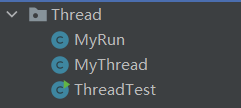 
- MyRun
  ```java
    package com.Thread;

    import java.util.Random;

    /**
    * @author 林一
    * @data 2021/5/3
    */
    public class MyRun implements Runnable {
        @Override
        public void run(){
            while (true){
                try {
                    Thread.sleep(1000);
                } catch (InterruptedException e) {
                    e.printStackTrace();
                }
                System.out.println("我是: " + Thread.currentThread().getName());
            }
        }
    }

  ```
- MyThread
  ```java
    package com.Thread;

    /**
    * @author 林一
    * @data 2021/5/3
    */
    public class MyThread extends Thread{
        public MyThread() {
        }

        public MyThread(String name) {
            super(name);
        }

        @Override
        public void run(){
            while (true){
                try {
                    Thread.sleep(1000);
                } catch (InterruptedException e) {
                    e.printStackTrace();
                }
                System.out.println("我是: " + Thread.currentThread().getName());
            }
        }
    }

  ```
- ThreadTest
  ```java
    package com.Thread;

    import com.Thread.MyRun;
    import com.Thread.MyThread;

    /**
    * @author 林一
    * @data 2021/5/3
    *
    * 电脑里面会有很多应用程序,一个程序就是一个进程
    * 一个进程里面可以包含很多线程
    */
    public class ThreadTest {
        public static void main(String[] args) {

            Thread t1 = new MyThread("一号线程");
            t1.start();

            Thread t2 = new Thread(new MyRun(),"Run线程");
            t2.start();


            while (true){
                try {
                    Thread.sleep(1000);
                } catch (InterruptedException e) {
                    e.printStackTrace();
                }
                System.out.println("我是: " + Thread.currentThread().getName());
            }

        }
    }

  ```

## 安全问题
- 
  - 首先,下面的多线程是会越界报错的,并且数据也是不完全的
    - Fori
    ```java
    package com.suplin.Test;

    /**
    * @author 林一
    * @data 2021/5/3
    */
    public class Fori implements Runnable {

        @Override
        public void run() {
            for (int i = 0; i < 100; i++) {
                ThreadTest.LIST.add(i);
            }
            System.out.println("执行了一次");
        }
    }

    ```
    - ThreadTest
    ```java
    package com.suplin.Test;

    import java.util.ArrayList;
    import java.util.List;
    import java.lang.Thread;


    /**
    * @author 林一
    * @data 2021/5/3
    *
    * 电脑里面会有很多应用程序,一个程序就是一个进程
    * 一个进程里面可以包含很多线程
    */
    public class ThreadTest {

        public static List<Integer> LIST = new ArrayList<>();

        public static void main(String[] args) {
            for (int i = 0; i < 5; i++) {
                Thread thread = new Thread(new Fori());
                thread.start();
            }

            try {
                Thread.sleep(5000);
            } catch (InterruptedException e) {
                e.printStackTrace();
            }

            System.out.println("一共有: " + LIST.size() + "个数据");


        }

    }

    ```
  - 然后,如果继承的List 下面的`Vector`这个子类,则不会出错,他会让线程有顺序的执行
    - ThreadTest
    ```java
    package com.suplin.Test;

    import java.util.List;
    import java.lang.Thread;
    import java.util.Vector;


    /**
    * @author 林一
    * @data 2021/5/3
    *
    * 电脑里面会有很多应用程序,一个程序就是一个进程
    * 一个进程里面可以包含很多线程
    */
    public class ThreadTest {

        public static List<Integer> LIST = new Vector<>();

        public static void main(String[] args) {
            for (int i = 0; i < 5; i++) {
                Thread thread = new Thread(new Fori());
                thread.start();
            }

            try {
                Thread.sleep(5000);
            } catch (InterruptedException e) {
                e.printStackTrace();
            }

            System.out.println("一共有: " + LIST.size() + "个数据");


        }

    }

    ```

  - 原因:
    - 在类似`Vector`类里面,他的方法前有一个`synchronized` ,它可以让线程有序进行

- HashMap 也不是线程安全的,但是 Hashtable是线程安全的

# String StringBuilder StringBuffer
- String 
  - 在连接多个字符串的时候会开辟新的内存,所以浪费内存严重
- StringBuilder 
  - 线程不安全,会造成数据混乱
  - 如有线程共享的时候不使用此类
  - 速度比StringBuffer快
- StringBuffer
  - 线程安全

# 异常
## 异常分类
1. 受查异常---checkedException
2. 运行时异常---RuntimeException
## 异常处理
- 抛异常:
  - 在方法名后边写`throws InterruptedException` 这个是把异常抛给调用他的其他方法
  - 在方法里面写`throw new *****` 则是单纯往外抛出一个异常
- try
  ```java
    try {
        Thread.sleep(1000);
    } catch (InterruptedException e) {
        e.printStackTrace();
    }
  ```

# 流(IO in&out)---Stream
- 按照流向划分,可以分成输入流和输出流,其流向是相对于程序来说的
- 按照单元划分,可以分成字节流和字符流,一个字符等于两个字节
- 按照角色划分,可以分成节点流和处理流
  - 节点流:
    - 流 怼在某个文件上或者某个设备上或者****,就是节点流
  - 处理流:
    - 怼在流上的流就叫作处理流
  
|分类|字节输入流|字节输出流|字符输入流|字符输出流|
|:-:|:-:|:-:|:-:|:-:|
| |InputStream|OutputStream|Reader|Writer|

## File类  对象  的方法
- 可执行吗: canExecute()
- 可写吗: canWrite()
- 可读吗: canRead()
- 当且仅当不存在时创建文件: createNewFile()
- 删除文件: delete()
- 返回绝对路径: getAbsolutePath()
- 返回父路径: getParent()
- 拿到一个父路径的file对象: getParentFile()
- 返回分区总的的空间大小: getTotalSpace()
- 返回分区可使用的空间大小: getUsableSpace()
- 判断是不是文件夹: isDirectory()
- 判断是不是文件: isFile()
- 返回最后修改时间的时间戳: lastModified()
  - 结合Date类查看完整的时间:`new Date(file.lastModified())`
- 返回文件大小: length()
- 创建目录: mkdir()
- 如果创建的目录有未被创建的目录,则: mkdirs()

## 拷贝文件
```java
import org.junit.Test;

import java.io.*;

/**
 * @author 林一
 * @data 2021/5/4
 */
public class CopyFile {

    /**
     *  不能写成static
     */
    @Test
    public void copy(){

        // 为什么要定义在try外面,因为定义在try里面,finally里面就不能用了
        InputStream fileInputStream = null;
        OutputStream outputStream = null;

        try {
            // 当前文件路径
            fileInputStream = new FileInputStream("C:\\Users\\林一\\Desktop\\新建文件夹\\内存清理.exe");
            // 拷贝目标路径
            outputStream = new FileOutputStream("C:\\Users\\林一\\Desktop\\内存清理.exe");
            // 弄一个桶来装数据,一个一个的从磁盘拉到内存中,然后再从内存中拉到磁盘
            byte[] buffer = new byte[1024];

            // 当前读了多少个
            int len;
            // 如果那个桶里头还有个数,就一直循环转移
            while ((len = fileInputStream.read(buffer)) != -1){
                // 写进另一个地址,第二个0 为从下标为0 开始写, 一共写len个长度的东西,如果不加len,会数据错误
                outputStream.write(buffer,0,len);
            }


        } catch (FileNotFoundException e) {
            e.printStackTrace();

        } catch (IOException e) {
            e.printStackTrace();
        } finally {   //关闭流
            if (fileInputStream != null){
                try {
                    fileInputStream.close();
                } catch (IOException e) {
                    e.printStackTrace();
                }
            }
            if (outputStream != null){
                try {
                    outputStream.close();
                } catch (IOException e) {
                    e.printStackTrace();
                }
            }
        }
    }
}

```
### 进度条版
```java
import org.junit.Test;

import java.io.*;
import java.util.Map;

/**
 * @author 林一
 * @data 2021/5/4
 */
public class Copy {
    @Test
    public void copy(){
        InputStream is = null;
        OutputStream os = null;

        try {

            File file = new File("C:\\Users\\林一\\Desktop\\前端\\47\\play.html");

            // 文件总大小
            long length = file.length();
            // 拷贝的效率
            int per = 1;
            // 已经拷贝的
            long completed = 0L;
            // 抽离出进度,以作为后续判断
            long currentProgress = 0L;


            // 输入流和输出流
            is = new FileInputStream("C:\\Users\\林一\\Desktop\\前端\\47\\play.html");
            os = new FileOutputStream("C:\\Users\\林一\\Desktop\\play.html");
            // 桶
            byte[] buffer = new byte[per];

            // 当前读了多长
            int len;
            // 开始拷贝
            while ((len = is.read(buffer)) != -1){
                completed += per;
                os.write(buffer,0,len);
//                System.out.println("已经拷贝了" + String.format("%.2f",((double)completed/length) * 100) + "%");

                // 当前进度
                long progress = Math.round((double)completed/length* 100);
                if (currentProgress != progress){
                    System.out.println("已经拷贝了" + progress + "%");
                }
                currentProgress = progress;

            }

        } catch (FileNotFoundException e) {
            e.printStackTrace();
        } catch (IOException e) {
            e.printStackTrace();
        } finally {  // 关闭流
            if (is != null){
                try {
                    is.close();
                } catch (IOException e) {
                    e.printStackTrace();
                }
            }
            if (os != null){
                try {
                    os.close();
                } catch (IOException e) {
                    e.printStackTrace();
                }
            }
        }

    }
}

```

## 读取文件
```java
import org.junit.Test;

import java.io.BufferedReader;
import java.io.FileInputStream;
import java.io.FileReader;
import java.io.Reader;

/**
 * @author 林一
 * @data 2021/5/4
 */
public class Read {

    /**
     * 字节流读取
     * @throws Exception
     */
    @Test
    public void read() throws Exception{
        FileInputStream fileInputStream = new FileInputStream("C:\\Users\\林一\\Desktop\\a.txt");
        byte[] buffer = new byte[16];
        int len;
        while ((len = fileInputStream.read(buffer)) != -1){
            String s = new String(buffer,0,len);
            System.out.println(s);
        }
        fileInputStream.close();
    }

    /**
     * 字符流读取
     * @throws Exception
     */
    @Test
    public void read2() throws Exception{
        Reader reader = new FileReader("C:\\Users\\林一\\Desktop\\a.txt");
        char[] buffer = new char[1024];
        int len;
        while ((len = reader.read(buffer)) != -1){
            String s = new String(buffer,0,len);
            System.out.println(s);
        }
        reader.close();
    }

    /**
     * 处理流读取
     * @throws Exception
     */
    @Test
    public void read3() throws Exception{
        Reader reader = new FileReader("C:\\Users\\林一\\Desktop\\a.txt");
        BufferedReader bf = new BufferedReader(reader);
        while (bf.readLine() != null){
            System.out.println(bf.readLine());
        }
        reader.close();
    }
}

```

## 写入文件
```java
import org.junit.Test;

import java.io.*;
import java.util.Scanner;

/**
 * @author 林一
 * @data 2021/5/4
 */
public class Writer {
    public static void main(String[] args) throws IOException {

        /**
         * 打印流写入
         * @throws Exception
         */
        // 怼一根管道
        // 后面的true 就是追加的意思
        FileWriter outputStream = new FileWriter("C:\\Users\\林一\\Desktop\\a.txt",true);
        PrintWriter printWriter = new PrintWriter(outputStream);

        String data = "";
        Scanner scanner = new Scanner(System.in);
        while (!"exit".equals(data)){
            data = scanner.next();
            printWriter.println(data);
            printWriter.flush();

        }
        printWriter.close();
        
    }


    /**
     * 字节流写入
     * @throws Exception
     */
    @Test
    public void writer() throws Exception{
        // 怼一根管道
        FileOutputStream outputStream = new FileOutputStream("C:\\Users\\林一\\Desktop\\a.txt");
        String data = "hello world";
        outputStream.write(data.getBytes());
        System.out.println("***写入完成***");
        outputStream.flush();
        outputStream.close();
    }

    /**
     * 字符流写入
     * @throws Exception
     */
    @Test
    public void writer2() throws Exception{
        // 怼一根管道
        FileWriter outputStream = new FileWriter("C:\\Users\\林一\\Desktop\\a.txt");
        String data = "林一";
        outputStream.write(data);
        System.out.println("***写入完成***");
        outputStream.flush();
        outputStream.close();
    }

    /**
     * 高级流写入
     * @throws Exception
     */
    @Test
    public void writer3() throws Exception{
        // 怼一根管道
        FileWriter outputStream = new FileWriter("C:\\Users\\林一\\Desktop\\a.txt");
        BufferedWriter bufferedReader = new BufferedWriter(outputStream);

        bufferedReader.write("asdfsfdsf");
        bufferedReader.newLine();
        bufferedReader.write("asdfsadfsadfdsfsdfsd");
        bufferedReader.append("林一");

        bufferedReader.flush();
        bufferedReader.close();
    }


}

```

## 面向对象储存内容
### 序列化
- 要在需要写入的对象后面实现`Serializable` 的接口,才能 序列化
- User
  ```java
    package com.IOtest;

    import java.io.Serializable;

    /**
    * @author 林一
    * @data 2021/5/4
    */
    public class User implements Serializable {
        private String Username;


        public String getUsername() {
            return Username;
        }

        public void setUsername(String username) {
            Username = username;
        }
    }

  ```
- IOtest
  ```java
    package com.IOtest;

    import org.junit.Test;
    import java.io.FileOutputStream;
    import java.io.IOException;
    import java.io.ObjectOutputStream;

    /**
    * @author 林一
    * @data 2021/5/4
    */
    public class IOtest {
        
        @Test
        public void objectTest() throws IOException {
            FileOutputStream fo = new FileOutputStream("C:\\Users\\林一\\Desktop\\lin.txt");
            ObjectOutputStream oos = new ObjectOutputStream(fo);
            User user = new User();
            user.setUsername("wanwan");

            oos.writeObject(user);

            oos.flush();
            oos.close();
        }
    }
  ```

### 反序列化
```java
@Test
public void objectTest() throws IOException, ClassNotFoundException {
    FileInputStream fi = new FileInputStream("C:\\Users\\林一\\Desktop\\lin.txt");
    ObjectInputStream ois = new ObjectInputStream(fi);

    User user = (User)ois.readObject();
    System.out.println(user.getUsername());
    
}
```

# 网络编程入门
- ip:
  - 一个网卡一个ip地址
- 端口
  - 一个电脑有65536个端口
  

- QQServer
  ```java
    package com.suplin;

    import java.io.IOException;
    import java.io.InputStream;
    import java.net.InetSocketAddress;
    import java.net.ServerSocket;
    import java.net.Socket;
    import java.net.SocketAddress;

    /**
    * @author 林一
    * @data 2021/5/5
    */
    public class QQServer {
        public static void main(String[] args) throws IOException {

            // 创建一个服务器
            ServerSocket serverSocket = new ServerSocket();
            // 绑定一个端口
            serverSocket.bind(new InetSocketAddress(8888));
            // 监听端口打开    阻塞
            Socket accept = serverSocket.accept();
            // 用流接收消息
            InputStream inputStream = accept.getInputStream();

            byte[] buffer = new byte[1024];
            int len;
            while ((len = inputStream.read(buffer)) != -1){
                System.out.println(new String(buffer,0,len));
            }
            inputStream.close();

        }
    }

  ```
- QQ
  ```java
    package com.suplin;

    import java.io.OutputStream;
    import java.net.InetSocketAddress;
    import java.net.Socket;

    /**
    * @author 林一
    * @data 2021/5/5
    */
    public class QQ {
        public static void main(String[] args) throws  Exception{

            Socket socket = new Socket();
            socket.connect(new InetSocketAddress("127.0.0.1",8888));
            OutputStream outputStream = socket.getOutputStream();
            String mg = "哈喽";
            outputStream.write(mg.getBytes());
            outputStream.flush();
            outputStream.close();

        }
    }

  ```

# 枚举
- 关键字 为 **enum**
- 枚举项最好别超过30个
- 枚举项用大写,中间用逗号,最后用分号结尾
- 对象的方法:
  - name() ---> 名字
  - compareTo() ---> 比较
- 使用枚举类的时候,默认使用无参构造,且只构造器只需要写构造器名就行,public不需要写
- 一旦枚举项被调用,就会new 好几个对象,个数取决于枚举项的个数


# 泛型:
- 只是规定在编译的时候,在编译后的程序中没有任何泛型,即泛型擦除
- 泛型设计原则:只要在编译的时候没有报错,那么在运行时就不会出现ClassCastException
- <数据类型> ---> 只能是引用类型
## 泛型方法

```java
package com.fanxing;

/**
 * @author 林一
 * @data 2021/5/5
 */
public class Test {
    public static void main(String[] args) {
        Test test = new Test();
        test.show("wer");
        test.show(2);
        test.show(1.4);
    }
    // 啥都能传了
    public <T> void show(T t){
        System.out.println(t);
    }
}

```


## 泛型类派生的子类
- 如果明确了泛型类型,则只需要在继承时的父类后面写上泛型类型
  - `public class Person implements Animal<String>{}`
  
- 如果没有明确类型,那么需要在子类和父类的后面都写生形参
  - `public class Person<T> implements Animal<T>{}`

## 泛型通配符
- ? 可以代表任意类型
  - <?>
- 通配符上限: 限制?可以代表哪些类型
  - `List<? extends Number> list`
  - ? 只能是 Number类 以及 他的子类
- 通配符下限:
  - `List<? super Integer> list`
  - ? 只能是 Integer类 以及 他的父类

