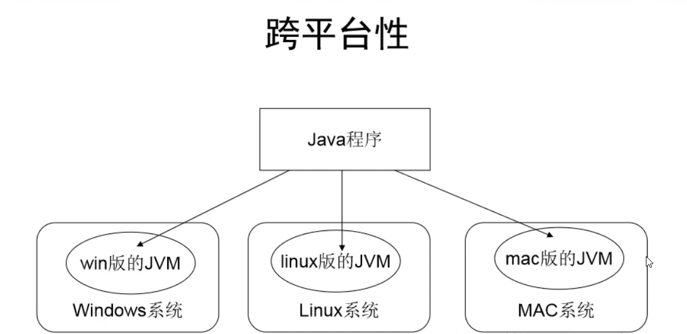
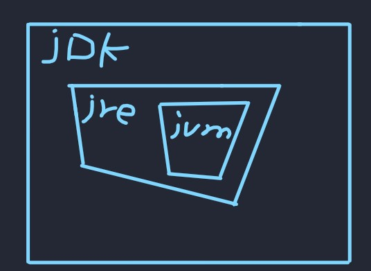
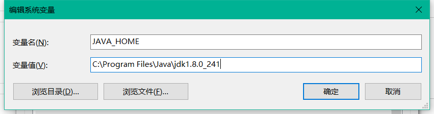
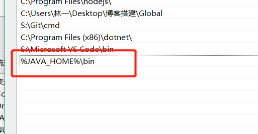
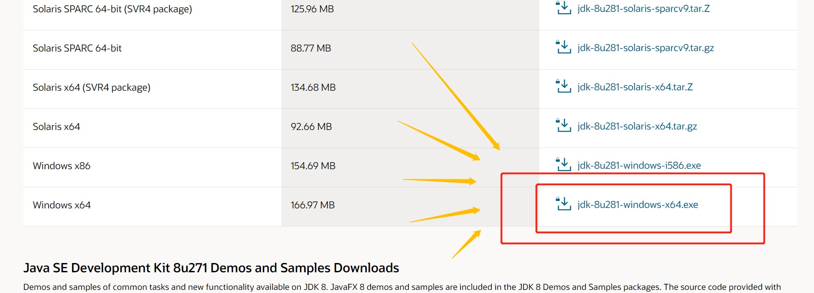

# **java认知**
1995/5/23  java诞生

## java 三版本：
- 标准版：java SE
- 企业版：java EE
- 微型版：java ME

## java SE 两个里程碑（新增较多特性）：
> java SE 5

> java SE 8

## 跨平台性：
> 一个java文件，经jre编译成二进制文件后，再给到jvm去执行二进制文件

> 只需在不同操作系统中安装不同的jvm，就可以在不同的平台中执行相同的二进制文件

## jdk，jre，jvm 区别
> jdk --- java开发工具包

> jre --- java运行时环境

> jvm --- java虚拟机 --- 执行class文件

> 包含关系：jdk包含了jre ， jre包含了jvm

> 

## 为什么使用java 8 ：
> 大多数java程序对java的最低要求是java 8

> 在java 8 中能运行的程序一定可以在高版本中使用

> java 8 较稳定

## 为什么要装环境：
> 微信要在软件中运行

> 所以java程序也得在软件中运行，jdk则是这个软件

- 设置环境变量：
    - JAVA_HOME
    - bin所在的目录
    - 
    - 然后去到path里面
    - %JAVA_HOME%\bin
    -  

# 下载jdk 8  ------>  [jdk 8 下载直链](https://www.oracle.com/fr/java/technologies/javase/javase-jdk8-downloads.html)
